# PMS Ship-Shore Sync — Testing Manual

**Version:** 1.0
**Date:** April 2026
**For:** Domain Expert Team (Jeevan, Rahul, Sahil)

---

## About This Document

This manual guides you through testing the ship-shore sync feature step by step. Follow each test case exactly as written. At the end of each test, mark it as **PASS** or **FAIL** in the checklist.

### What is Sync?

When PMS runs on a ship, the ship's computer and the office computer need to share data. For example:

- **Office adds a new component** → the ship should see it after sync
- **Ship completes a work order** → the office should see it after sync
- **Ship consumes a spare part** → the office should see the stock change after sync

The "Sync" feature does this automatically. Your job is to test that it works correctly.

### What You'll Need

- Access to PMS on the **office server** (shore)
- Access to PMS on the **ship server**
- A vessel that has data in it (components, work orders, spares)
- A pen to mark PASS/FAIL on the checklist at the end

---

## How to Find the Sync Pages

**Step 1:** Log in to PMS

**Step 2:** Look at the left sidebar. You'll see icons for different sections.

**Step 3:** Click the **Admin** section at the top menu bar.

**Step 4:** In the left sidebar under Admin, you will see three sync-related items:

| Icon | Label | What it does |
|------|-------|-------------|
| ☁️ Cloud icon | **Sync Dashboard** | Monitor sync, press the sync button, see history |
| 💾 Hard Drive icon | **Ship Provisioning** | Prepare initial data package for a ship |
| 🌐 Globe icon | **Fleet Overview** | See all vessels' sync status (**office only** — you won't see this on a ship) |

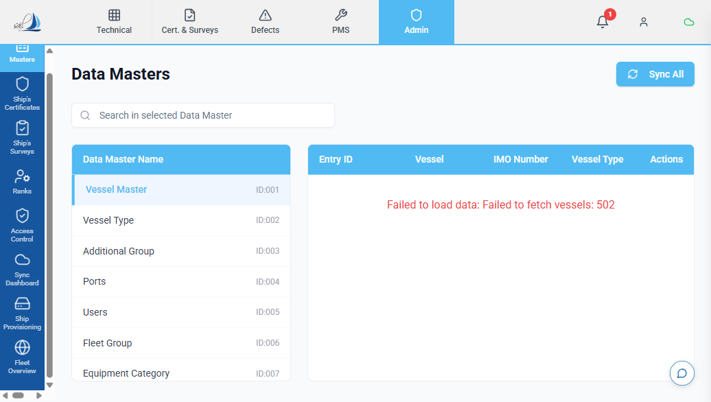

---

## Test Case 1: Open the Sync Dashboard

**What we're testing:** The Sync Dashboard page loads correctly and shows the right information.

### Steps

1. Click **Admin** in the top menu bar
2. Click **Sync Dashboard** (cloud icon) in the left sidebar

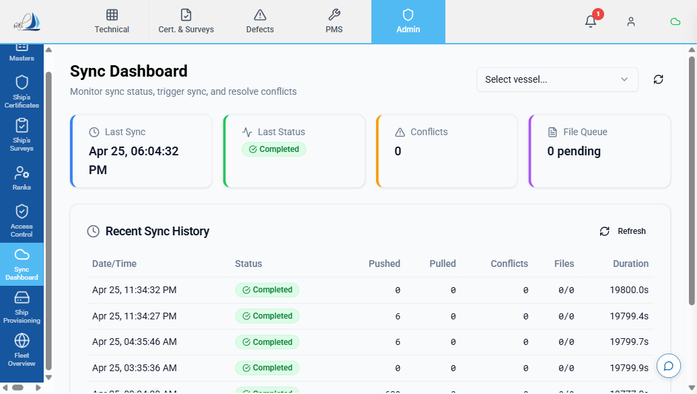

3. Look at the **top of the page**. You should see the title **"Sync Dashboard"** with the subtitle "Monitor sync status, trigger sync, and resolve conflicts"

4. Look at the **four coloured cards** near the top:

   | Card | Left border colour | What it shows |
   |------|--------------------|---------------|
   | **Last Sync** | Blue | When the last sync happened — a date and time, or "Never" |
   | **Last Status** | Green | A badge showing "Completed" (green), "Failed" (red), or "N/A" |
   | **Conflicts** | Amber/Orange | A number — should be **0** if everything is normal |
   | **File Queue** | Purple | Shows "X pending" — should be **0 pending** normally |

   

5. Below the cards, look for the **vessel selector dropdown** at the top right. It says "Select vessel...". Click it and pick your test vessel.

   

6. Scroll down. You should see a section called **"Recent Sync History"** with a table. The table columns are: Date/Time, Status, Pushed, Pulled, Conflicts, Files, Duration. If no sync has happened yet, you'll see a cloud icon with "No sync history yet" — that's OK.

   

### Pass/Fail

- [ ] Page loaded without any error messages
- [ ] I can see the four coloured status cards
- [ ] I can see the vessel dropdown and select a vessel
- [ ] I can see the "Recent Sync History" section

---

## Test Case 2: Press the Sync Now Button

**What we're testing:** The sync button works and a sync cycle finishes without errors.

### Steps

1. Go to **Admin → Sync Dashboard**
2. Select your test vessel from the dropdown at the top right
3. Below the status cards, find the section titled **"Sync Now"** (with a lightning bolt ⚡ icon)
4. Click the blue **"Sync Now"** button

   

5. Watch what happens:
   - The button text changes to **"Syncing..."** with a spinning icon
   - A **blue progress bar** appears below the button
   - Below the progress bar, you see a **grey log area** with messages like:
     - "Initiating sync session..."
     - "Pushing local changes..."
     - "Pulling shore updates..."
     - "Processing file queue..."

   *[The sync progress bar and log messages will appear here during an active sync]*

6. Wait for the sync to finish (usually 2–10 seconds). When done:
   - The progress bar reaches 100%
   - The log area shows green text: "Sync complete"
   - Below the log, **five summary boxes** appear showing:

   | Box | Label | What it means |
   |-----|-------|---------------|
   | ↑ Blue arrow | **Pushed** | How many changes went FROM this server TO the other side |
   | ↓ Green arrow | **Pulled** | How many changes came FROM the other side TO this server |
   | ⚠️ Amber triangle | **Conflicts** | How many disagreements were found (should be 0) |
   | 📄 Purple file | **Files** | How many files were transferred |
   | 🕐 Grey clock | **Duration** | How long the sync took |

   *[The five summary boxes will appear here after sync completes]*

7. A green toast notification should appear at the top right saying **"Sync Complete"** with "Pushed X, pulled Y records"

8. Scroll down to **"Recent Sync History"** — a new row should appear at the top of the table with a green **"Completed"** badge

   

### Pass/Fail

- [ ] The "Sync Now" button was clickable
- [ ] The progress bar appeared while syncing
- [ ] Log messages appeared in the grey area
- [ ] Five summary boxes appeared after completion
- [ ] A green "Sync Complete" message appeared
- [ ] A new "Completed" row appeared in the history table

---

## Test Case 3: Edit a Work Order and Check It Syncs

**What we're testing:** When you change a work order, the sync system detects the change.

### Steps

1. Click **PMS** in the top menu bar
2. Click **Work Orders** in the left sidebar
3. Find any work order in the list and click on it to open it

   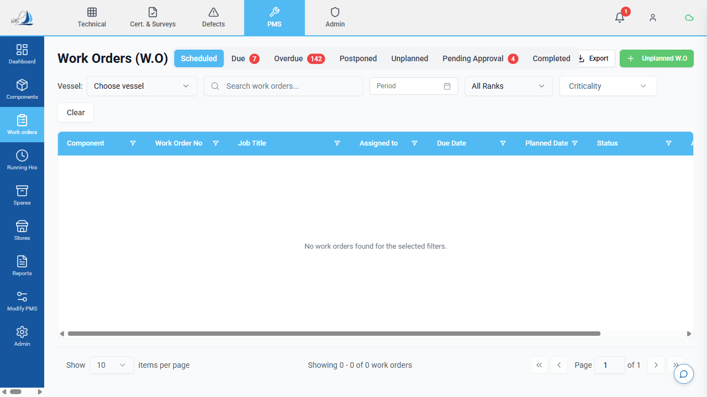

4. Find a text field you can edit — for example, the **Remarks** field at the bottom of the work order
5. Type something you'll recognize later, like:
   > "Sync test by [your name] — [today's date]"

   *[Open a work order and find the Remarks field at the bottom]*

6. Click **Save** to save your changes
7. Now go back to the Sync Dashboard: Click **Admin** → **Sync Dashboard**
8. Select your vessel from the dropdown
9. Look at the **"Last Sync"** card — it should still show the OLD sync time
10. Click **"Sync Now"** and wait for it to finish
11. After sync finishes, look at the summary boxes:
    - **Pushed** should show at least **1** (your work order change was sent)

   *[After sync, the Pushed count in the summary boxes should show 1 or more]*

### Pass/Fail

- [ ] I could edit the work order and save it
- [ ] After syncing, the "Pushed" count was at least 1
- [ ] The sync completed without errors

---

## Test Case 4: Consume a Spare Part and Check It Syncs

**What we're testing:** When you use a spare part, the stock change is captured for sync.

### Steps

1. Click **PMS** in the top menu bar
2. Click **Spares** in the left sidebar
3. Find a spare part that has stock (look for the **ROB** column — it should be more than 0)

   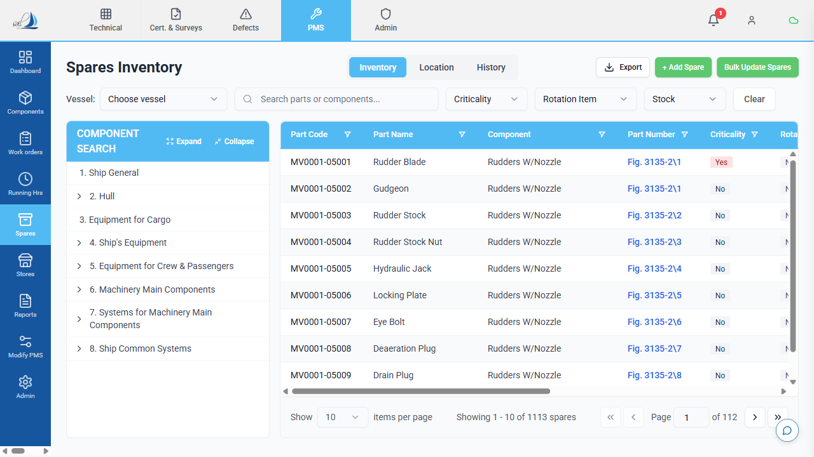

4. Click on the spare part to select it
5. Look for the **"Consume or Receive Spare"** dialog or the Consume/Receive buttons
6. Click **"Consume"** (the red button with a minus icon)

   *[Click a spare to see the Consume or Receive Spare dialog]*

7. In the **Consume Spare** dialog that opens:
   - Enter **Qty**: 1
   - Enter **Date**: today's date (should be pre-filled)
   - Optionally add **Remarks**: "Sync test"
   - Click the **Save** button at the bottom

   *[Fill in the quantity and click Save in the Consume Spare dialog]*

8. Verify the **ROB** number went down by 1
9. Go to **Admin → Sync Dashboard**
10. Click **"Sync Now"**
11. After sync, check that **Pushed** shows at least 1

### Pass/Fail

- [ ] I could consume a spare part successfully
- [ ] The ROB number decreased after consuming
- [ ] After syncing, the change was pushed (Pushed ≥ 1)

---

## Test Case 5: Record a Stores Transaction and Check It Syncs

**What we're testing:** When you issue or receive a stores item, the change is captured for sync.

### Steps

1. Click **PMS** in the top menu bar
2. Click **Stores** in the left sidebar
3. Find a stores item that has stock (ROB > 0)

   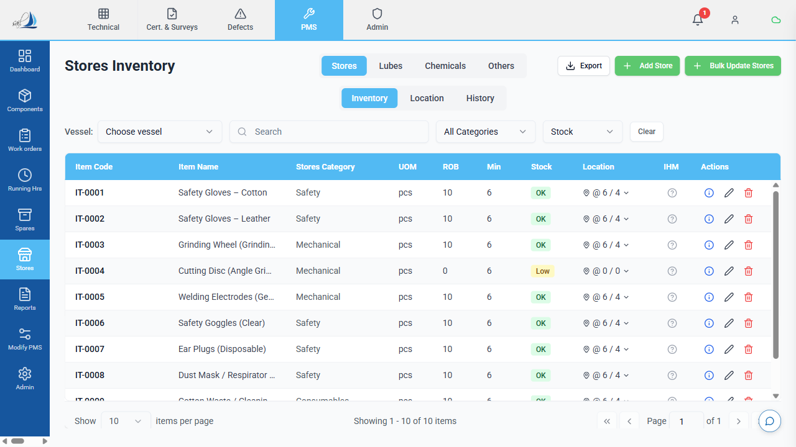

4. Select the item and perform a **Consume** or **Issue** action (similar to spares)
5. Enter quantity: 1 and save
6. Verify the stock number changed
7. Go to **Admin → Sync Dashboard** → Click **"Sync Now"**
8. After sync, check that **Pushed** ≥ 1

### Pass/Fail

- [ ] I could issue/consume a stores item
- [ ] The stock number changed correctly
- [ ] After syncing, the change was pushed

---

## Test Case 6: Create a New Defect and Check It Syncs

**What we're testing:** When you report a new defect, it is captured for sync.

### Steps

1. Click **Defects** in the top menu bar
2. Click **Defect Log** in the left sidebar
3. Look for the **"New Defect"** button (blue button, usually at the top right of the page)

   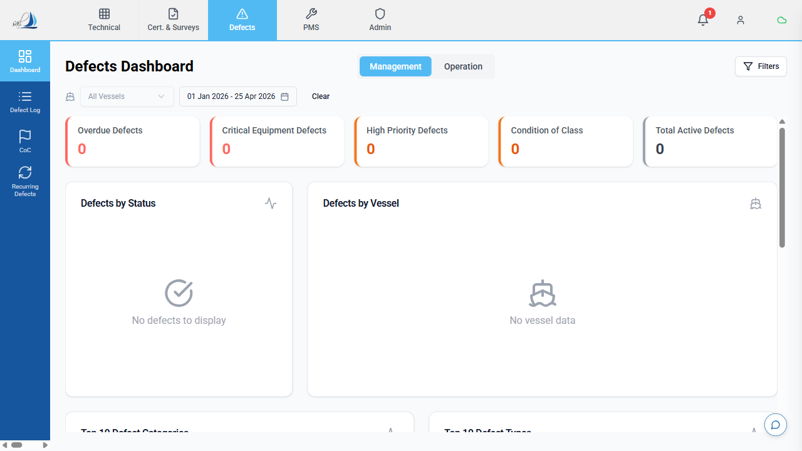

4. Click **"New Defect"**
5. The **New Defect Report** form opens. Fill in:
   - **Title**: "Sync Test Defect — [your name]"
   - **Description**: "Testing sync system"
   - **Category**: pick any
   - **Priority**: pick any
   - Fill in any other required fields (marked with *)

   *[Fill in the New Defect Report form — Title, Description, Category, Priority]*

6. Click **Save** at the bottom of the form
7. Note the **defect number** that was assigned
8. Go to **Admin → Sync Dashboard** → Click **"Sync Now"**
9. After sync, check that **Pushed** ≥ 1

### Additional test — Close the defect:

10. Go back to **Defects** → **Defect Log**
11. Find and open the defect you just created
12. Scroll down to **Part C — Closeout** section
13. Fill in the closeout fields (Closed By Name, Closed By Rank, etc.)
14. Save
15. Go to Sync Dashboard → Click **"Sync Now"** again
16. After sync, check that **Pushed** ≥ 1 again (the close action was sent)

### Pass/Fail

- [ ] I could create a new defect and save it
- [ ] After syncing, the new defect was pushed
- [ ] I could close the defect and save
- [ ] After syncing, the closure was pushed

---

## Test Case 7: Update a Certificate Date and Check It Syncs

**What we're testing:** When you update a certificate date, the change is captured for sync.

### Steps

1. Click **Cert & Surveys** in the top menu bar
2. Click **Certificates** in the left sidebar
3. Find a certificate in the list and click on it

   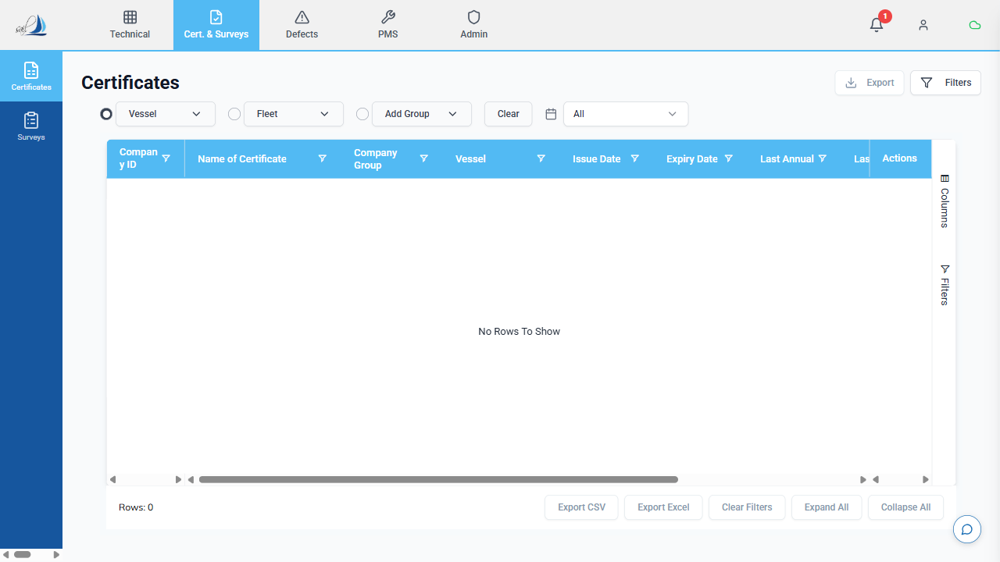

4. Change a date field — for example, the **Issue Date** or **Expiry Date**
5. Save the change
6. Go to **Admin → Sync Dashboard** → Click **"Sync Now"**
7. After sync, check that **Pushed** ≥ 1

### Pass/Fail

- [ ] I could update a certificate date and save
- [ ] After syncing, the change was pushed

---

## Test Case 8: Update Running Hours and Check It Syncs

**What we're testing:** When you update running hours, the change (including any child component cascades) is captured for sync.

### Steps

1. Click **PMS** in the top menu bar
2. Click **Running Hrs** in the left sidebar
3. The **Running Hours** page opens showing a table of components

   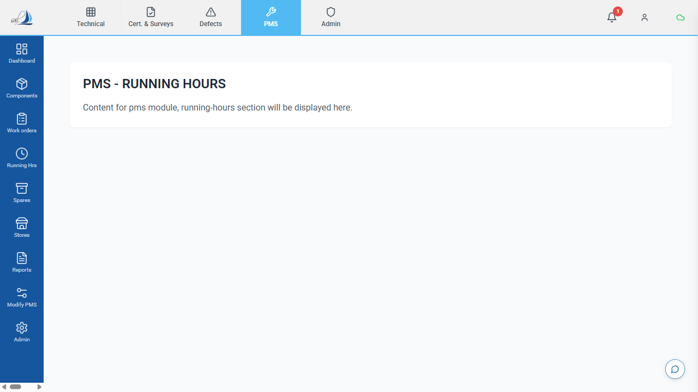

4. Find a component (e.g., Main Engine) and click the **"Update Running Hours"** button/icon on its row
5. In the **"Update Running Hours"** dialog:
   - Enter the new running hours value (higher than the current value)
   - Click **Save** / **Update**

   *[Enter new running hours value in the Update Running Hours dialog]*

6. Check if child components' hours also updated (some components cascade to children)
7. Go to **Admin → Sync Dashboard** → Click **"Sync Now"**
8. After sync, check that **Pushed** is ≥ 1 (could be more if child components cascaded)

### Pass/Fail

- [ ] I could update running hours and save
- [ ] After syncing, the changes were pushed
- [ ] If applicable, child component cascades were also pushed

---

## Test Case 9: Submit a Change Request (Modify PMS) and Check It Syncs

**What we're testing:** When you submit a change request via Modify PMS, it is captured for sync.

### Steps

1. Click **PMS** in the top menu bar
2. Click **Modify PMS** in the left sidebar
3. Create a new change request (follow the Modify PMS workflow)
4. Submit the request
5. Go to **Admin → Sync Dashboard** → Click **"Sync Now"**
6. After sync, check that **Pushed** ≥ 1

### Pass/Fail

- [ ] I could create and submit a change request
- [ ] After syncing, the change request was pushed

---

## Test Case 10: Provision a Ship (Generate Data Package)

**What we're testing:** The Ship Provisioning page can generate a data package for a vessel.

### Steps

1. Click **Admin** in the top menu bar
2. Click **Ship Provisioning** (hard drive icon) in the left sidebar
3. The **"Ship Provisioning"** page opens with the title and subtitle "Generate and manage vessel data bundles for initial ship server deployment"

   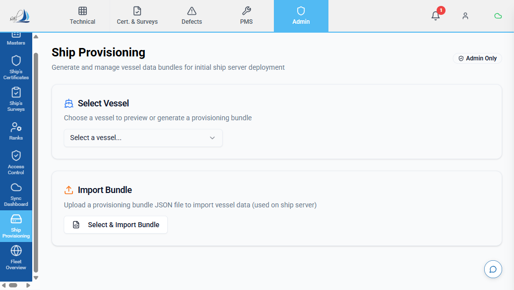

4. Under the **"Select Vessel"** section, click the dropdown that says "Select a vessel..."
5. Pick your test vessel from the list

   *[Click the vessel dropdown to select your test vessel]*

6. Now look for the **"Manifest Preview"** section below. Click the **"Preview"** button (has an eye 👁️ icon)

   

7. Wait a few seconds. A table should appear showing:

   | Column | What it shows |
   |--------|--------------|
   | **Table Name** | The name of each data table (e.g., components, jobs, work_orders) |
   | **Category** | Colour-coded label (blue = office data, amber = shared data, green = ship data) |
   | **Row Count** | How many records will be included |

   Above the table, you'll see **summary boxes**: one showing the total number of **Tables**, one showing **Total Rows**, and one showing the **Vessel** name.

   *[After clicking Preview, a table of tables and row counts appears]*

8. Check that the numbers make sense:
   - **components**: should have rows (50–500 is typical)
   - **jobs**: should have rows
   - **work_orders**: should have rows (if the vessel is active)
   - **Total Rows**: should be more than 100

9. Now scroll down to the **"Generate & Download Bundle"** section
10. Click the green **"Generate & Download Bundle"** button

   *[Click the green Generate & Download Bundle button]*

11. Wait for the download:
    - A progress bar appears with messages: "Initiating bundle generation..." → "Exporting tables..." → "Preparing download..." → "Download complete!"
    - A file downloads to your computer (named something like `provision_VESSELID_2026-04-25.json`)
    - A green notification appears: **"Bundle Downloaded"** with the file size

   *[A green notification appears when the download completes]*

12. Check the downloaded file size — it should be between **1 MB and 20 MB** for a typical vessel

### Pass/Fail

- [ ] I could select a vessel from the dropdown
- [ ] The Preview button showed a table with row counts
- [ ] Row counts looked reasonable (not all zeros)
- [ ] The "Generate & Download Bundle" button worked
- [ ] A file downloaded to my computer
- [ ] The file size was reasonable (1–20 MB)

---

## Test Case 11: Fleet Sync Overview (Office Server Only)

**What we're testing:** The Fleet Overview page shows all vessels and their sync status. This page should only be visible on the **office server**, not on a ship.

### Part A: Check visibility

**On the office server:**

1. Click **Admin** in the top menu bar
2. Look in the left sidebar for **"Fleet Overview"** (globe 🌐 icon)
3. It **should be visible** → continue to Part B

**On a ship server:**

1. Click **Admin** in the top menu bar
2. Look in the left sidebar for "Fleet Overview"
3. It **should NOT be visible** — you should only see "Sync Dashboard" and "Ship Provisioning"
4. If you don't see it → that's correct! Mark Part A as PASS

### Part B: Check the Fleet Overview page (office only)

1. Click **Fleet Overview** in the left sidebar
2. The page opens with the title **"Fleet Sync Overview"** and subtitle "Shore-side fleet-wide sync monitoring and configuration"

   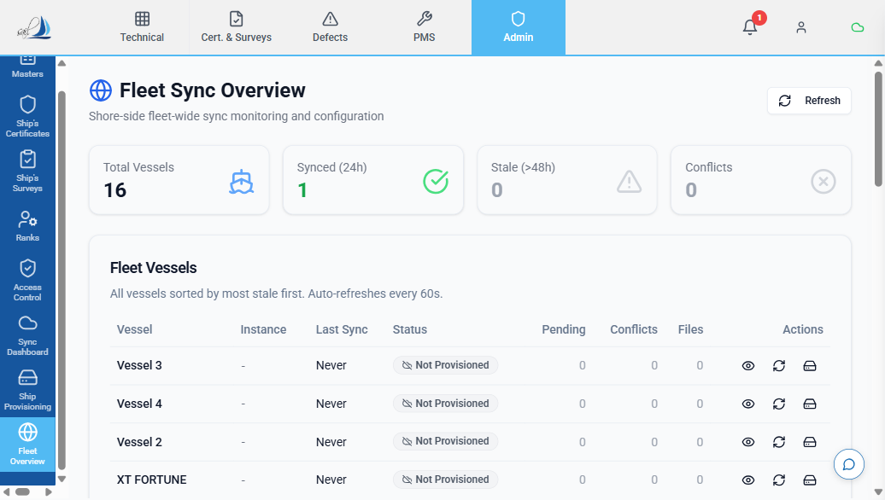

3. Look at the **four summary cards** at the top:

   | Card | What it shows |
   |------|--------------|
   | **Total Vessels** | Total number of vessels in the fleet |
   | **Synced (24h)** | How many vessels synced in the last 24 hours (green number) |
   | **Stale (>48h)** | How many vessels haven't synced for over 48 hours (amber/orange) |
   | **Conflicts** | Total unresolved conflicts across all vessels (red if > 0) |

   

4. Below the cards, look at the **"Fleet Vessels"** table:

   | Column | What it shows |
   |--------|--------------|
   | **Vessel** | Vessel name |
   | **Instance** | The ship server's ID (like "SHIP-VESSEL01") or "-" if not provisioned |
   | **Last Sync** | How long ago (e.g., "2h ago", "3d ago", or "Never") |
   | **Status** | A colour-coded badge: green "Synced", amber "Stale", red "Overdue"/"Conflicts", grey "Not Provisioned" |
   | **Pending** | Number of changes waiting to sync |
   | **Conflicts** | Number of unresolved conflicts |
   | **Files** | Number of pending file transfers |
   | **Actions** | Three small buttons: 👁️ (view dashboard), 🔄 (sync now), 💾 (provision) |

   

5. Check that all your fleet vessels appear in the table

### Part C: Check the Sync Settings panel

1. Scroll down past the vessel table
2. Find the **"Sync Settings"** section (has a gear ⚙️ icon and says "Database-persisted sync configuration")
3. Click on it to **expand** it (it's collapsed by default)

   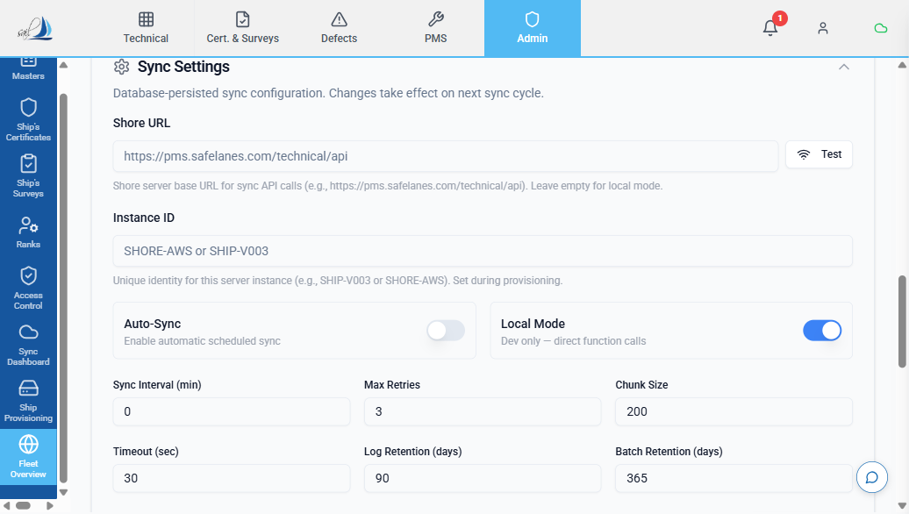

4. You should see these settings:

   | Setting | What it controls |
   |---------|-----------------|
   | **Shore URL** | The office server's address |
   | **Instance ID** | This server's identity name |
   | **Auto-Sync** toggle | Whether sync runs automatically (on/off switch) |
   | **Local Mode** toggle | Development setting (on/off switch) |
   | **Sync Interval (min)** | How often auto-sync runs (in minutes) |
   | **Max Retries** | How many times to retry if sync fails |
   | **Chunk Size** | How many records to send at once |
   | **Timeout (sec)** | How long to wait for a response |
   | **Log Retention (days)** | How long to keep sync logs |
   | **Batch Retention (days)** | How long to keep sync history |

5. Try changing one setting — for example, change **Sync Interval (min)** from 60 to 30
6. Click the **"Save Settings"** button (bottom right of the settings panel). A number badge shows how many settings you changed.

   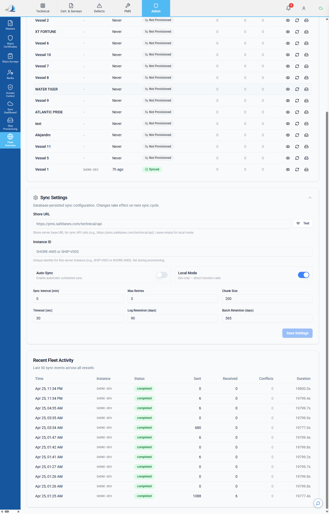

7. A green notification should appear: **"Settings saved"** — "Sync engine will reload on next cycle."
8. **Refresh the page** (press F5 or click the browser refresh)
9. Expand the Settings section again — your change should still be there (it was saved permanently)

### Part D: Test Connection

1. In the Settings panel, next to the **Shore URL** field, find the **"Test"** button (has a WiFi icon)
2. Click **"Test"**
3. One of two things will happen:
   - ✅ Green text: **"Connected in Xms"** — the connection works
   - ❌ Red text: **"Connection failed: ..."** — the connection doesn't work (may be expected if there's no second server)

   *[Click the Test button next to Shore URL to see Connected or Failed result]*

### Pass/Fail

- [ ] **Part A:** Fleet Overview is visible on office server
- [ ] **Part A:** Fleet Overview is hidden on ship server (or N/A if you only have one server)
- [ ] **Part B:** Summary cards show correct counts
- [ ] **Part B:** Vessel table lists all vessels with status badges
- [ ] **Part C:** Settings panel expands and shows all settings
- [ ] **Part C:** I could change a setting and save it
- [ ] **Part C:** The setting persisted after page refresh
- [ ] **Part D:** Test Connection button showed a result

---

## Test Case 12: Check the Sync Status Icon in the Header

**What we're testing:** The cloud icon in the top bar shows sync status at a glance.

### Steps

1. Look at the **top right area** of the PMS header bar
2. Find the **cloud icon** (☁️). This is the Sync Status Indicator.

   | Cloud colour | What it means |
   |-------------|--------------|
   | **Green** ☁️ | Everything is synced — no pending changes |
   | **Yellow** ☁️ | There are pending changes or conflicts — need to sync |
   | **Red** with line ☁️ | Offline — cannot reach the other server |
   | **Blue spinning** 🔄 | Sync is currently running |

   

3. If there's a **small yellow number badge** on the cloud icon, it shows how many pending items there are (changes + conflicts)

4. **Click** on the cloud icon — a small popup appears showing:
   - **"Sync Status"** header with Online/Offline badge
   - **"Last sync:"** with time (e.g., "5m ago" or "Never")
   - If there are pending changes: "X pending changes"
   - If everything is synced: ✅ "All changes synced"
   - A **"Sync Now"** button at the bottom
   - A link to **"Open Sync Dashboard"** at the very bottom

   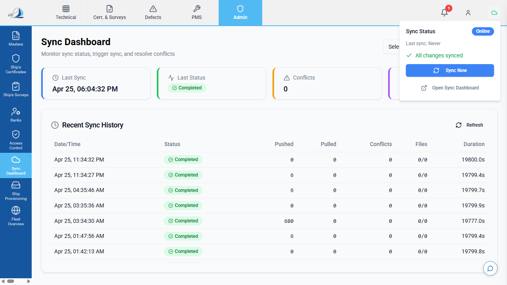

5. If you see "All changes synced" in green, click **"Open Sync Dashboard"** to go to the full dashboard

### Pass/Fail

- [ ] I can see the cloud icon in the top right header
- [ ] Clicking it opens a popup with sync status details
- [ ] The "Sync Now" button in the popup works
- [ ] "Open Sync Dashboard" link navigates to the dashboard

---

## Test Case 13: Check the Conflict Resolution Screen

**What we're testing:** When the ship and office both change the same thing, a conflict appears and can be resolved.

> **Note:** This test requires TWO people — one on the office server and one on the ship server. If you're testing alone, you can skip this test.

### Setup

1. Make sure both servers are synced (no pending changes on either side)
2. Pick a work order that exists on both servers
3. Note the work order number

### Create the Conflict

**Person on the OFFICE server — DO NOT SYNC YET:**

4. Open the work order
5. Change the **Remarks** field to: "Updated by office — [your name]"
6. Save

**Person on the SHIP server — DO NOT SYNC YET:**

7. Open the SAME work order
8. Change the **Remarks** field to: "Updated by ship — [your name]"
9. Save

### Sync and Find the Conflict

10. On the **ship server**, go to **Admin → Sync Dashboard** → Click **"Sync Now"**
11. After sync completes, look at the summary boxes — **Conflicts** should show **1** (or more)

### View and Resolve the Conflict

12. Scroll down on the Sync Dashboard to the **"Unresolved Conflicts"** section (has an amber branch icon and may show a red badge with the count)

   *[The Unresolved Conflicts section appears below the sync history when conflicts exist]*

13. You should see a table with these columns:

   | Column | What it shows |
   |--------|--------------|
   | **Table** | Which data type had the conflict (e.g., "work_orders") |
   | **Row** | Which specific record |
   | **Field** | Which field (e.g., "remarks") |
   | **Ship Value** | What the ship entered (shown in blue) |
   | **Shore Value** | What the office entered (shown in green) |
   | **Actions** | Two buttons: "Ship Wins" and "Shore Wins" |

14. To resolve the conflict, click one of the buttons:
    - **"Ship Wins"** → the ship's text is kept
    - **"Shore Wins"** → the office's text is kept

   *[Each conflict row has "Ship Wins" and "Shore Wins" buttons — click one to resolve]*

15. After clicking, a notification says **"Conflict Resolved"**
16. The conflict disappears from the table
17. The **"Conflicts"** card at the top should go back to **0**

### Pass/Fail

- [ ] Both sides could edit the same work order
- [ ] After syncing, a conflict appeared
- [ ] The conflict table showed both values (ship and shore)
- [ ] I could resolve the conflict using Ship Wins or Shore Wins
- [ ] After resolving, the conflict disappeared

---

## Final Validation Checklist

After completing all test cases, fill in this summary:

| # | Test Case | PASS | FAIL | Tester | Date | Notes |
|---|-----------|------|------|--------|------|-------|
| 1 | Sync Dashboard loads | ☐ | ☐ | | | |
| 2 | Sync Now button works | ☐ | ☐ | | | |
| 3 | Work order edit syncs | ☐ | ☐ | | | |
| 4 | Spare part consume syncs | ☐ | ☐ | | | |
| 5 | Stores transaction syncs | ☐ | ☐ | | | |
| 6 | Defect creation & closure syncs | ☐ | ☐ | | | |
| 7 | Certificate date update syncs | ☐ | ☐ | | | |
| 8 | Running hours update syncs | ☐ | ☐ | | | |
| 9 | Change request syncs | ☐ | ☐ | | | |
| 10 | Ship Provisioning works | ☐ | ☐ | | | |
| 11 | Fleet Overview (office only) | ☐ | ☐ | | | |
| 12 | Header sync status icon | ☐ | ☐ | | | |
| 13 | Conflict resolution | ☐ | ☐ | | | |

**Overall Result:** ☐ PASS / ☐ FAIL

---

## Sign-Off

| Name | Role | Date | Signature |
|------|------|------|-----------|
| Jeevan Naik | Domain Expert | | |
| Rahul Singh Sisodiya | Domain Expert | | |
| Sahil Puri | Domain Expert | | |
| | QA Lead | | |
| Ghazi Anwer | GM — IT | | |

---

## If Something Doesn't Work

If any test fails or you see an error:

1. **Take a screenshot** of the error (press the Print Screen key or use the Snipping Tool)
2. **Write down which test case** failed (the test number)
3. **Write down what you did** just before the error
4. **Write down which vessel** you were working with
5. **Send the screenshot and notes** to Ghazi

**Do NOT try to fix anything yourself. Just report what you see.**
