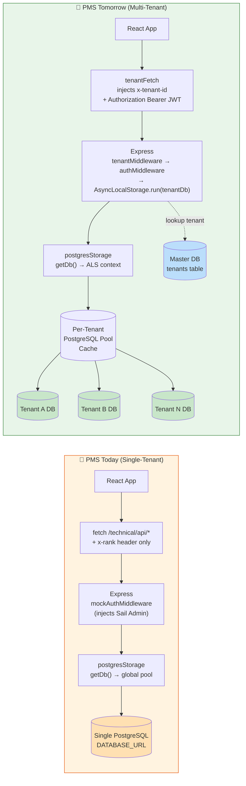
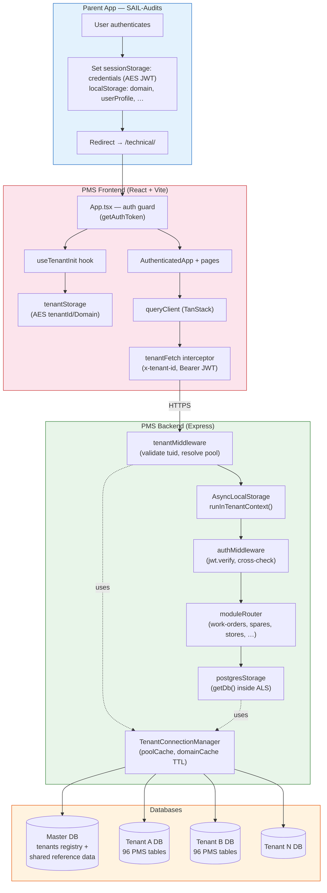
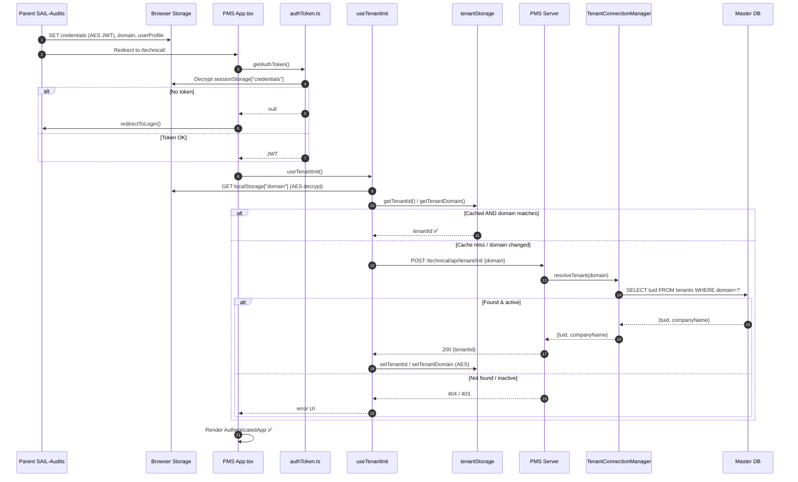
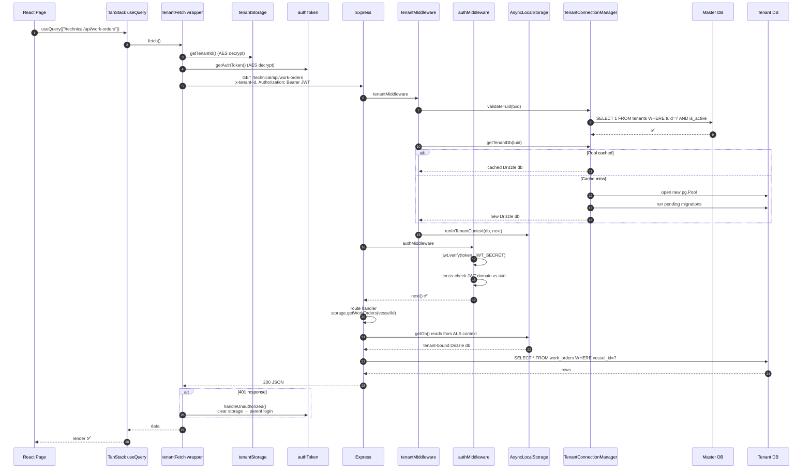
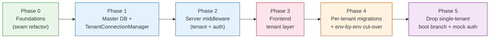
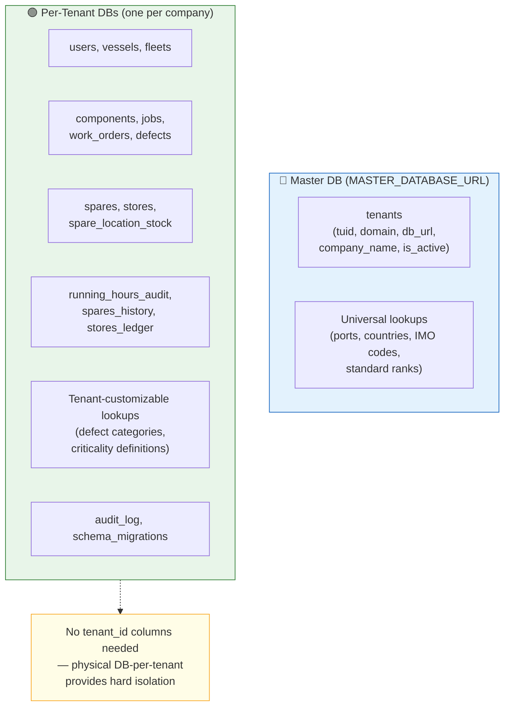
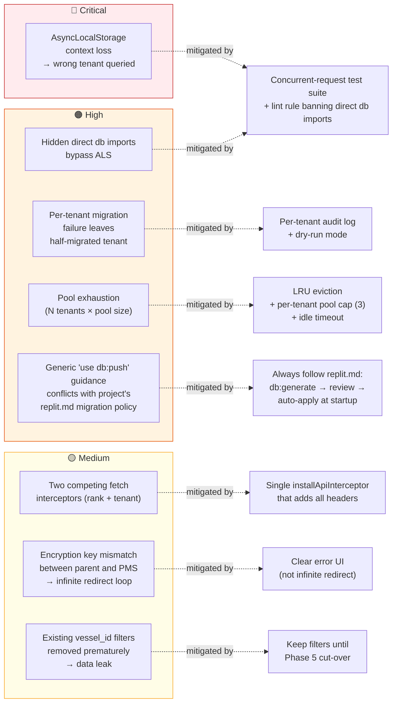

# Multi-Tenant Architecture for Maritime PMS — Approach & Implementation Document

> **Status:** Proposal / blueprint
> **Source pattern:** CrewingV2 multi-tenant model (parent SAIL-Audits → encrypted token in browser → tenant resolution → per-tenant DB via `AsyncLocalStorage`)
> **Target:** Maritime PMS (single-tenant today)
> **Last updated:** 2026-04-24

---

## Table of Contents

1. [Executive Summary](#1-executive-summary)
2. [Current vs Target — Side-by-Side](#2-current-vs-target--side-by-side)
3. [Target Architecture Overview](#3-target-architecture-overview)
4. [End-to-End Request Sequence](#4-end-to-end-request-sequence-after-migration)
5. [Implementation Approach — 5 Phases](#5-implementation-approach--5-phases)
6. [Schema-Split Decisions](#6-schema-split-decisions)
7. [Risk Register](#7-risk-register)
8. [Key Source Files Reference](#8-key-source-files-reference)
9. [Environment Variables](#9-environment-variables)
10. [Open Questions to Resolve Before Phase 1](#10-open-questions-to-resolve-before-phase-1)
11. [Recommended Next Steps](#11-recommended-next-steps)
12. [Appendix A — Baseline Inventory (Current PMS)](#appendix-a--baseline-inventory-current-pms)
13. [Appendix B — CrewingV2 Reference Pattern](#appendix-b--crewingv2-reference-pattern)
14. [Appendix C — Gap Analysis Matrix](#appendix-c--gap-analysis-matrix)

---

## 1. Executive Summary

PMS is currently single-tenant: one `DATABASE_URL`, one global `pg.Pool`, mock auth, and "isolation" between vessels enforced only by `vessel_id` filters in queries. Crewing demonstrates a **proven pattern** for converting this kind of app into a true multi-tenant SaaS where each customer (tenant) owns its own physical PostgreSQL database, requests are routed to the right database via an `AsyncLocalStorage` context, and all of this is **transparent to the service layer** (every method just calls `getDb()`).

This document proposes a **5-phase, incrementally shippable plan** for adopting that pattern in PMS without disrupting the current deployment. Each phase is gated by a feature flag (`MASTER_DATABASE_URL`) so that the existing single-tenant deployment continues to work unchanged until cut-over.

**Key architectural changes:**

- **New layer 1:** Master tenants registry (separate Postgres database)
- **New layer 2:** `TenantConnectionManager` with per-tenant pool cache and `AsyncLocalStorage` request scoping
- **New layer 3:** JWT verification + tenant-id middleware chain on the server
- **New layer 4:** AES-encrypted browser storage + `tenantFetch` interceptor on the client
- **New layer 5:** Per-tenant migration runner (re-uses existing `runDrizzleMigrations` with `--> statement-breakpoint` semantics)

**Migration policy reminder:** The project's `replit.md` strictly forbids `db:push` on existing databases (post-085 incident). All schema changes — including per-tenant migrations — go through the documented workflow: `db:generate` → review → commit → auto-apply at startup.

---

## 2. Current vs Target — Side-by-Side



---

## 3. Target Architecture Overview



---

## 4. End-to-End Request Sequence (After Migration)

### 4a. App boot — tenant initialization



### 4b. Every subsequent API call



---

## 5. Implementation Approach — 5 Phases



> Each phase is **independently shippable** and gated by a feature flag (`MASTER_DATABASE_URL` presence). Without the flag, PMS continues to behave exactly as today.

### Phase 0 — Foundations (no behaviour change)

| Task | Files affected | Outcome |
|---|---|---|
| Refactor `runDrizzleMigrations` / `runHandWrittenMigrations` to accept a `Pool` arg instead of reading global | `server/migrations.ts` | Migration runner is pool-agnostic |
| Audit & route every `process.env.DATABASE_URL` read through one helper | `server/postgresClient.ts`, `server/db.ts`, `drizzle.config.ts` | Single seam to swap |
| Make `getDb()` the only legal way to access the DB; lint/grep CI check banning direct `db`/`pool` imports | `server/db.ts` + lint rule | Future-proofs Phase 1 |
| Confirm `server/initDb.ts` works against any passed `Pool` | `server/initDb.ts` | Reuse for per-tenant init |

**Risk:** Low. **Reviewable in one PR.**

### Phase 1 — Master DB + Connection Manager

| Task | Files |
|---|---|
| New env var `MASTER_DATABASE_URL` (presence enables multi-tenant mode) | `.env`, `server/postgresClient.ts` |
| Create master schema with `tenants` table | new `shared/master/schema.ts` |
| Implement `TenantConnectionManager`: `resolveTenant(domain)`, `validateTuid(tuid)`, `getTenantDb(tuid)`, `runInTenantContext(tuid, cb)`, `poolCache`, 5-min `domainCache` TTL | new `server/utils/tenantConnectionManager.ts` |
| Modify `getDb()` to prefer `AsyncLocalStorage` context; fall back to global pool when not inside one | `server/db.ts` |

**Risk:** Medium — `AsyncLocalStorage` correctness across async boundaries needs concurrent-request tests.

### Phase 2 — Server Middleware Chain

| Task | Files |
|---|---|
| `tenantMiddleware`: extract `x-tenant-id`, validate against master, call `runInTenantContext` | new `server/middleware/tenantMiddleware.ts` |
| `authMiddleware`: `jwt.verify`, attach `req.user`, cross-check JWT `domain` vs `tuid` | new `server/middleware/authMiddleware.ts` |
| Boot logic in the route registration file branches on `MASTER_DATABASE_URL`: with the var set, mount `tenantMiddleware → authMiddleware → moduleRouter` on `/technical/api/*`; without it, today's `mockAuthMiddleware → moduleRouter` chain runs unchanged | `server/routes.ts` (future Phase 2 PR — out of scope for this docs task) |
| Exempt-path list (`/technical/api/tenant/init`, `/technical/api/tenant/health`) | new `server/middleware/exemptPaths.ts` |
| Dev escape: `AUTH_BYPASS=true` short-circuits both middlewares | new `server/middleware/authMiddleware.ts` (mockAuthMiddleware itself is left untouched in Phase 2) |
| New endpoint `POST /technical/api/tenant/init` mounted **before** the catch-all chain | new `server/modules/tenant/routes.ts`, wired in the route registration file |

**Risk:** Medium — exempt-path list is a known foot-gun.

### Phase 3 — Frontend Tenant Layer

| Task | Files |
|---|---|
| `tenantStorage` — AES `setTenantId/getTenantId/setTenantDomain/getTenantDomain` | new `client/src/lib/tenantStorage.ts` |
| `authToken` — decrypt sessionStorage["credentials"], `redirectToLogin`, `handleUnauthorized` | new `client/src/lib/authToken.ts` |
| `useTenantInit` hook | new `client/src/hooks/useTenantInit.ts` |
| `tenantFetch` — single fetch interceptor that **also** keeps the existing `x-rank` injection (consolidate) | new `client/src/lib/tenantFetch.ts`, modify `client/src/lib/activeRank.ts` and `queryClient.ts` |
| Wire into `App.tsx`: auth guard → `useTenantInit` → `AuthenticatedApp` | `client/src/App.tsx` |
| New env vars: `VITE_PARENT_LOGIN_URL`, `VITE_AUTH_BYPASS`, reuse existing `VITE_STORAGE_SECRET` (alias as `VITE_CLIENT_ENCRYPTION_KEY`) | `.env` |

**Risk:** Low–Medium — composing two interceptors is the main risk.

### Phase 4 — Per-Tenant Migrations + Environment Cut-over

| Task | Files |
|---|---|
| On first `getTenantDb(tuid)` for a tenant, run full migration suite against that tenant DB | `server/utils/tenantConnectionManager.ts` |
| One-shot promotion script: register existing prod DB as the `default` tenant in master | new `scripts/promote-to-tenant.ts` |
| Environment-by-environment cut-over (dev → staging → prod) — each environment flips `MASTER_DATABASE_URL` once; module priority order applies to post-flip smoke testing rather than to URL changes | (no client URL changes — single API surface) |
| Dev parity harness: boot two server instances against the same DB, one with `MASTER_DATABASE_URL` set and one without, diff GET responses across all 8 modules | new `scripts/parity-diff.ts` |
| Per-tenant migration audit log (which tenant has which migrations applied) | new admin endpoint |

**Risk:** **High** — migration bugs are amplified N-fold across tenants. Mitigate with dry-runs and per-tenant audit log.

> **Migration policy reminder:** the project's `replit.md` strictly forbids `db:push` on existing databases (post-085 incident). Per-tenant migrations re-use the same `runDrizzleMigrations` runner with `--> statement-breakpoint` semantics — no exceptions.

### Phase 5 — Decommission Legacy

| Task | Files |
|---|---|
| Drop the single-tenant `else` branch from the boot logic so the multi-tenant chain on `/technical/api/*` becomes unconditional | `server/routes.ts` (Phase 5 PR — out of scope for this docs task) |
| Remove `mockAuthMiddleware` (or gate behind `AUTH_BYPASS` only) | `server/middleware/auth.ts` (Phase 5 PR — out of scope for this docs task) |
| Remove eager `pool`/`db` exports in `server/db.ts` | `server/db.ts` |
| Move agreed reference tables to master DB | `shared/master/schema.ts`, migrations |

**Risk:** Low if Phase 4 was thorough.

---

## 6. Schema-Split Decisions



| Decision | Recommendation | Why |
|---|---|---|
| Tenant isolation model | **Physical DB-per-tenant** | Matches Crewing; no risk of cross-tenant leaks via missed `WHERE`; simpler queries |
| `tenant_id` columns on every table | **No** | Physical isolation makes them redundant |
| Where `vessels`, `fleets`, `users` live | Per-tenant | Each company owns its fleet |
| Universal master lists (ports, ranks, countries) | Master DB | True read-only reference |
| Tenant-customizable lookups | Per-tenant | Companies define their own categories |

### Proposed master `tenants` table

```typescript
// shared/master/schema.ts
export const tenants = pgTable("tenants", {
  tuid: text("tuid").primaryKey().default(sql`gen_random_uuid()::text`),
  domain: text("domain").notNull().unique(),     // e.g. "acme-shipping.example.com"
  companyName: text("company_name").notNull(),
  dbUrl: text("db_url").notNull(),               // encrypted at rest
  isActive: boolean("is_active").notNull().default(true),
  isDeleted: boolean("is_deleted").notNull().default(false),
  createdAt: timestamp("created_at").notNull().defaultNow(),
  updatedAt: updatedAtColumn(),
  createdByUuid: text("created_by_uuid"),
  updatedByUuid: text("updated_by_uuid"),
});
```

---

## 7. Risk Register



| Risk | Severity | Mitigation |
|---|---|---|
| `AsyncLocalStorage` context lost across `setTimeout`/event-emitter boundaries → wrong tenant gets queried | **Critical** | Comprehensive test suite that fires concurrent requests for different tenants and verifies isolation. Lint rule (or grep CI check) banning `db` imports from `server/db.ts` outside `getDb()` calls. |
| Per-tenant migration failure leaves a tenant in half-migrated state | **High** | Wrap migration in transaction where possible; per-tenant audit log; expose `/admin/tenant-health` endpoint that reports each tenant's migration state. |
| Connection pool exhaustion (N tenants × pool size = explosion) | **High** | LRU eviction on `poolCache`; per-tenant pool size cap (e.g., 3 connections); idle-pool timeout to release rarely-used tenants. |
| Migrating ~100 storage methods that may secretly touch the DB outside `getDb()` | **High** | Phase 0 audit script: grep for `pool.query`, `import { db }`, `import { pool }` in `server/`. |
| Existing `vessel_id` filter logic becomes redundant once tenants are isolated, but premature removal during migration leaks data | **Medium** | Keep `vessel_id` filters until Phase 5 cut-over is complete. |
| Frontend has two competing fetch interceptors (`activeRank` + new tenant interceptor) | **Medium** | Consolidate into a single `installApiInterceptor` that adds all headers in one wrap. |
| `VITE_CLIENT_ENCRYPTION_KEY` mismatch between parent and PMS app → `credentials` undecryptable | **Medium** | Document the env var contract; provide a `tenant-init` page that surfaces a clear error rather than infinite redirect loop. |
| Migration policy conflict — generic guidance suggests `db:push --force`, but the PMS project's own `replit.md` forbids it after the 085 incident | **High (process)** | **Always follow the project's `replit.md` migration workflow** (`db:generate` → review → commit → auto-apply at startup). Per-tenant migrations re-use the same hardened runner. |

---

## 8. Key Source Files Reference

| Layer | File (new = ➕, modify = ✏️) | Role |
|---|---|---|
| Frontend | ➕ `client/src/lib/tenantStorage.ts` | AES tenantId/Domain in localStorage |
| Frontend | ➕ `client/src/lib/authToken.ts` | Decrypt JWT, redirect on logout |
| Frontend | ➕ `client/src/lib/tenantFetch.ts` | Fetch interceptor with all headers |
| Frontend | ➕ `client/src/hooks/useTenantInit.ts` | Tenant init hook |
| Frontend | ✏️ `client/src/App.tsx` | Auth guard + tenant init wiring |
| Frontend | ✏️ `client/src/lib/queryClient.ts` | Compose with tenantFetch |
| Frontend | ✏️ `client/src/lib/activeRank.ts` | Merge into single interceptor |
| Backend | ➕ `server/middleware/tenantMiddleware.ts` | Validate x-tenant-id, bind DB |
| Backend | ➕ `server/middleware/authMiddleware.ts` | JWT verify, cross-check |
| Backend | ➕ `server/middleware/exemptPaths.ts` | Paths that skip middleware |
| Backend | ➕ `server/utils/tenantConnectionManager.ts` | Pool cache, ALS, master lookup |
| Backend | ➕ `shared/master/schema.ts` | Master DB schema (tenants table) |
| Backend | ✏️ `server/db.ts` | `getDb()` reads from ALS |
| Backend | ✏️ `server/routes.ts` (Phase 2 PR, **not** this docs task) | Branch boot logic on `MASTER_DATABASE_URL` to pick the multi-tenant chain on the existing `/technical/api/*` mount |
| Backend | ✏️ `server/migrations.ts` | Accept `Pool` arg |
| Backend | ✏️ `server/initDb.ts` | Accept `Pool` arg |
| Scripts | ➕ `scripts/promote-to-tenant.ts` | Register existing DB as default tenant |

---

## 9. Environment Variables

| Variable | Side | Purpose |
|---|---|---|
| `MASTER_DATABASE_URL` | Backend | **Presence enables multi-tenant mode** |
| `DATABASE_URL` | Backend | Default single-tenant connection (back-compat / dev) |
| `JWT_SECRET` | Backend | Verify JWTs from parent SAIL-Audits |
| `AUTH_BYPASS` | Backend | Skip JWT in dev (only when `JWT_SECRET` absent) |
| `VITE_AUTH_BYPASS` | Frontend | Skip auth on client side (dev) |
| `VITE_PARENT_LOGIN_URL` | Frontend | Logout / 401 redirect target |
| `VITE_CLIENT_ENCRYPTION_KEY` | Frontend | AES key for storage (alias for existing `VITE_STORAGE_SECRET`) |

---

## 10. Open Questions to Resolve Before Phase 1

1. **Identity provider** — same parent SAIL-Audits app as Crewing (so JWT secret + encryption key are shared)?
2. **Existing prod data** — does today's DB need to be promoted as the "default" tenant, or is this green-field?
3. **Reference-data split** — fleet/vessel master records: per-tenant (each company manages its own) or master (Sail manages globally)?
4. **`x-rank` mock-auth** — does QA still need rank impersonation, or does the parent JWT now carry `rank`?
5. **Cut-over timeline** — environment-by-environment with soak windows (dev → staging → prod, recommended) or big-bang flip in prod? PMS's single API surface means there is no per-module toggle, so the unit of risk is always the environment.
6. **Per-tenant infra** — N physical Postgres databases on the same server, or N separate servers? (Affects backup, monitoring, cost.)

---

## 11. Recommended Next Steps

1. Workshop the §10 questions (30–60 min) — answers shape Phases 1, 4, and the schema-split.
2. Sign off on physical-DB-per-tenant as the isolation model.
3. **Phase 0 first** — zero-behaviour-change refactor that sets up the seams. Reviewable in one PR.
4. After Phase 0 lands, plan Phases 1+2 together (server side) and Phase 3 in parallel (frontend can be built and tested against a `tenant/init` mock).

---

## Appendix A — Baseline Inventory (Current PMS)

| Layer | Implementation | File(s) |
|---|---|---|
| **Auth** | Mock — every request gets a hardcoded `Sail Admin` user; rank resolved from `x-rank` header | `server/middleware/auth.ts` (`mockAuthMiddleware`) |
| **Frontend session** | `localStorage` items (`userProfile`, `userType`, `userRole`) AES-encrypted via `CryptoJS` and `VITE_STORAGE_SECRET` | `client/src/utils/secureStorage.ts`, `client/src/contexts/AuthContext.tsx` |
| **Frontend fetch** | TanStack Query default fetcher; `installRankFetchInterceptor` injects only `x-rank` on `/technical/api/*` calls. No `Authorization`, no `x-tenant-id` | `client/src/lib/queryClient.ts`, `client/src/lib/activeRank.ts` |
| **DB connection** | Single global `pg.Pool` from `process.env.DATABASE_URL`; lazy cached singleton | `server/postgresClient.ts`, `server/db.ts` |
| **Storage layer** | `IStorage` interface implemented once in `postgresStorage.ts` (~100 methods, all call `await getDb()` at the top) | `server/storage.ts`, `server/postgresStorage.ts` |
| **Request scoping** | **None** — no `AsyncLocalStorage`, no per-request DB binding | n/a |
| **Routes** | All mounted under `/technical/api` via a single `moduleRouter` aggregating per-module sub-routers | `server/routes.ts`, `server/modules/index.ts` |
| **Module structure** | One folder per domain with `routes.ts` → `controllers/` → `services/` → `repositories/` (functionally equivalent to Crewing's per-module layout, despite the different folder name) | `server/modules/{work-orders, defects, spares, stores, running-hours, components, …}` |
| **Schema** | 96 tables in `shared/schema.ts`. No `tenant_id` / `tuid` column anywhere. "Soft tenancy" via `vessel_id` (vuuid) only | `shared/schema.ts` |
| **Migrations** | Hybrid: legacy JS array (frozen, 001–081), Drizzle-generated `0XXX_*.sql`, hand-written `0XX_*.sql`. Applied at startup by `runDrizzleMigrations`. **Strict rule:** never `db:push` on an existing DB (post-085 incident) | `server/migrations.ts`, `migrations/`, `replit.md` |
| **Reference data** | Master lists, ranks, fleets, vessels — all live in the same DB as transactional data | `shared/schema.ts`, `server/initDb.ts` |

---

## Appendix B — CrewingV2 Reference Pattern

| Layer | Crewing implementation |
|---|---|
| **Identity origin** | Parent SAIL-Audits app sets `sessionStorage["credentials"]` (AES-encrypted JWT), `localStorage["domain"]`, `localStorage["userProfile"]`, etc. and redirects to `/crewing/` |
| **Boot guard** | `App.tsx` calls `getAuthToken()` → if missing, `redirectToLogin()` clears storage and bounces to `VITE_PARENT_LOGIN_URL` |
| **Tenant init** | `useTenantInit` reads encrypted `domain`, checks cached `tenantId`/`tenantDomain` in `localStorage`, and on cache miss calls `POST /api/v2/tenant/init { domain }` (Crewing path) which queries the **master** `tenants` table and returns `{tuid, companyName}`. PMS will mount the same endpoint at `/technical/api/tenant/init` to fit its existing single-API surface. |
| **Fetch interceptor** | `tenantFetch.ts` patches `window.fetch` to inject `x-tenant-id` (decrypted from `localStorage["tenantId"]`) + `Authorization: Bearer <jwt>` on every `/api/*` call; on `401` it logs the user out |
| **Server middleware chain** | `tenantMiddleware` → validates `x-tenant-id` against master DB → calls `runInTenantContext(tuid, …)` which puts the tenant Drizzle instance into `AsyncLocalStorage`. `authMiddleware` runs second, verifies JWT, cross-checks JWT `domain` against `tuid` |
| **Connection manager** | `TenantConnectionManager` keeps a `poolCache<tuid, pg.Pool>`; on miss it opens a new pool, runs pending migrations for that tenant, caches it. Has 5-minute TTL cache for `domain → tuid` lookups |
| **Service layer** | Every service method calls `const db = getDb()` which reads from `AsyncLocalStorage` — so the **same code path automatically targets the right DB** based on the request's tenant |
| **Schema split** | Crewing's per-tenant tables live under `shared/v2/<module>/schema.ts`; a separate **master schema** holds `tenants`, plus shared reference data (nationalities, ports, ranks). PMS will keep its existing `shared/schema.ts` layout for per-tenant tables and add a parallel `shared/master/schema.ts` for the master schema. |
| **Env vars** | `MASTER_DATABASE_URL` (required to enable multi-tenant mode), `JWT_SECRET`, `AUTH_BYPASS`, `VITE_PARENT_LOGIN_URL`, `VITE_AUTH_BYPASS`, `VITE_CLIENT_ENCRYPTION_KEY` |

---

## Appendix C — Gap Analysis Matrix

| Concern | PMS today | Crewing target | Gap size |
|---|---|---|---|
| Identity provider | Mock | Parent SAIL-Audits JWT | **Large** — needs JWT verify, parent login redirect, encrypted browser storage |
| Tenant registry | None | Master DB `tenants` table | **Large** — new database + schema + lookup logic |
| Per-request DB scoping | None (global pool) | `AsyncLocalStorage` with per-tenant pool | **Large** — touches every storage method indirectly |
| Frontend fetch | Only `x-rank` injected | `x-tenant-id` + `Authorization` injected, 401 handling | **Medium** — pattern is identical, just expanded |
| Storage encryption | Already uses `CryptoJS` AES | Same library, same pattern | **Small** — reuse existing `secureStorage.ts` |
| Module/route layout | `/technical/api/<module>/…` | `/api/v2/<module>/…` (Crewing) | **None** — PMS keeps its single `/technical/api/*` surface; the chain in front of it is what changes |
| Migration runner | Per-DB, runs at startup | Per-tenant, runs on first connection | **Medium** — need to factor `runDrizzleMigrations` to accept a `Pool` arg and run lazily per tenant |
| Reference data (master lists, ranks, fleets) | Same DB as tenant data | Master DB | **Medium** — needs a split decision per table |
| `vessel_id` isolation | Only mechanism today | Becomes secondary — primary isolation is by tenant DB | **Conceptual** — vessel is now "within a tenant" |

---

**Files inspected for this report:** `replit.md`, `server/db.ts`, `server/postgresClient.ts`, `server/storageFactory.ts`, `server/middleware/auth.ts`, `server/routes.ts`, `server/modules/index.ts`, `server/migrations.ts`, `server/initDb.ts`, `client/src/lib/queryClient.ts`, `client/src/lib/activeRank.ts`, `client/src/contexts/AuthContext.tsx`, `client/src/utils/secureStorage.ts`, `shared/schema.ts`, plus the two attached Crewing reference docs.
