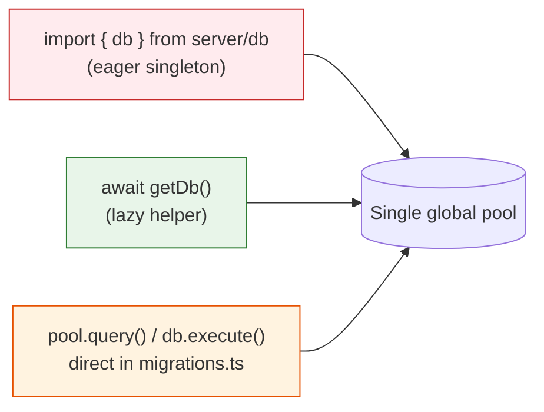

# Phase 0 — Foundations

> **Goal:** Refactor the database seam so the rest of the migration is possible. **Zero behavioural change.**
> **Risk:** 🟢 Low
> **Estimated effort:** 1 PR, ~1 week
> **Prerequisites:** None
> **Unblocks:** Phase 1

---

## 1. Why this phase exists

Today, code in PMS reaches the database in three different ways:



For multi-tenancy to work, **every database access must go through `getDb()`** — otherwise the `AsyncLocalStorage` context introduced in Phase 1 will be silently bypassed and the wrong tenant's data will be queried (or worse, written to). Phase 0 closes those loopholes **without** introducing any tenant logic. After Phase 0:

- All migration runners accept a `Pool` argument (so Phase 1 can pass a per-tenant pool).
- All service/repository code uses `await getDb()` exclusively.
- A CI lint rule prevents regressions.

---

## 2. Goals & non-goals

| Goal | Non-goal |
|---|---|
| Make the migration runner pool-agnostic | Implement multi-tenant migrations |
| Eliminate direct `db`/`pool` imports across `server/` | Change any business logic |
| Add a CI check that prevents regression | Add tenant context anywhere |
| Document the new "only `getDb()`" convention | Touch `shared/schema.ts` |

---

## 3. Current state — concrete inventory

### 3.1 Direct `db` imports to remove

```
server/modules/bulk-upload/controllers/bulkController.ts
server/modules/components/services/componentService.ts
server/modules/noon-report/repositories/bunkerRepository.ts
server/modules/noon-report/repositories/noonReportRepository.ts
server/modules/noon-report/services/alertEngine.ts
server/modules/noon-report/services/noonReportService.ts
server/modules/noon-report/services/calculationEngine.ts
server/modules/noon-report/utils/existingDataAdapter.ts
server/replit_integrations/chat/storage.ts
```

These import `{ db }` from `server/db.ts` (the eager export) and use it directly. They must be converted to `await getDb()`.

### 3.2 Files that read `process.env.DATABASE_URL` directly

```
server/postgresClient.ts        (lines 14, 33, 41 — getConnectionString and resolvePostgres)
server/db.ts                    (lines 14, 17 — eager init)
server/storageFactory.ts        (lines 9, 19 — feature flag check)
drizzle.config.ts               (CLI use)
```

### 3.3 Migration runners that read the global pool

`server/migrations.ts` (~180KB file with the legacy 001–081 array and the new `runDrizzleMigrations`/`runHandWrittenMigrations`/`runBackupAndMigrations`) — currently grabs the global pool internally. Needs to accept an optional `Pool` parameter.

`server/initDb.ts` (~37KB) — same pattern; called from `server/index.ts:53` as `initializeDatabase()`. Needs an overload that accepts a `Pool`.

`server/routes.ts:16` calls `ensureMaintenanceHistoryImmutability()` before route registration — same treatment.

---

## 4. Detailed steps

### Step 4.1 — Refactor migration runner signatures

Edit `server/migrations.ts`:

```typescript
// Before
export async function runDrizzleMigrations(): Promise<void> { … }
export async function runHandWrittenMigrations(): Promise<void> { … }
export async function runBackupAndMigrations(): Promise<void> { … }

// After
export async function runDrizzleMigrations(pool?: Pool): Promise<void> {
  const targetPool = pool ?? (await getPool());
  // … rest unchanged, but use targetPool everywhere
}

export async function runHandWrittenMigrations(pool?: Pool): Promise<void> {
  const targetPool = pool ?? (await getPool());
  // …
}

export async function runBackupAndMigrations(pool?: Pool): Promise<void> {
  const targetPool = pool ?? (await getPool());
  await runDrizzleMigrations(targetPool);
  await runHandWrittenMigrations(targetPool);
}
```

`server/index.ts:50` keeps calling `runBackupAndMigrations()` with no args — back-compat preserved.

### Step 4.2 — Refactor `initializeDatabase` and immutability trigger

Edit `server/initDb.ts`:

```typescript
export async function initializeDatabase(pool?: Pool): Promise<void> { … }
export async function ensureMaintenanceHistoryImmutability(pool?: Pool): Promise<void> { … }
```

Same pattern: optional pool argument, default to global.

### Step 4.3 — Convert the 9 direct-import files

For each file in §3.1, change:

```typescript
// Before
import { db } from "../../../db";
const rows = await db.select().from(...);

// After
import { getDb } from "../../../db";
const db = await getDb();
const rows = await db.select().from(...);
```

**Pitfall:** Some of these files use `db` at module top-level (e.g. for prepared statements or lookups during init). Move those into a lazy initializer or into the function bodies.

### Step 4.4 — Soft-deprecate the eager exports (do NOT remove yet)

Edit `server/db.ts:11-21`:

```typescript
/**
 * @deprecated Use getDb() / getPool() instead.
 * Will be removed in Phase 5 of the multi-tenant migration.
 * See docs/multi-tenant/README.md
 */
let pool: Pool | undefined;
let db: ReturnType<typeof drizzle> | undefined;

if (process.env.DATABASE_URL) {
  pool = new Pool({ connectionString: process.env.DATABASE_URL });
  db = drizzle(pool, { schema });
}

export { pool, db };
```

The JSDoc tag plus a TypeScript `@deprecated` will surface a strikethrough in IDEs to discourage new usage. Removal happens in Phase 5.

### Step 4.5 — Add CI lint check

Create `scripts/check-direct-db-imports.sh`:

```bash
#!/usr/bin/env bash
set -e

echo "Checking for direct { db } imports in server/…"
HITS=$(grep -rn "import {.*\bdb\b.*} from" server/ --include="*.ts" \
  | grep -v "from .*postgresStorage" \
  | grep -v "import { getDb" \
  | grep -v "// allow-direct-db" || true)

if [ -n "$HITS" ]; then
  echo "❌ Direct db imports found (use getDb() instead):"
  echo "$HITS"
  exit 1
fi

echo "Checking for direct { pool } imports in server/…"
POOL_HITS=$(grep -rn "import {.*\bpool\b.*} from \"\\./db\"" server/ --include="*.ts" || true)
if [ -n "$POOL_HITS" ]; then
  echo "❌ Direct pool imports found (use getPool() instead):"
  echo "$POOL_HITS"
  exit 1
fi

echo "✅ No direct db/pool imports."
```

Wire it into `package.json` as `"lint:db": "bash scripts/check-direct-db-imports.sh"` and call it from the existing pre-commit hook (or CI). The `// allow-direct-db` escape comment lets you intentionally bypass the rule for legitimate cases (e.g. inside `server/db.ts` itself).

### Step 4.6 — Document the new convention

Append a short section to `replit.md` under **Project Structure**:

```markdown
### Database access convention (multi-tenant ready)

All server code MUST access PostgreSQL via `await getDb()` from `server/db.ts`.
Direct imports of `db` or `pool` are blocked by `scripts/check-direct-db-imports.sh`.

This convention enables per-request tenant scoping introduced in the multi-tenant
migration (see docs/multi-tenant/README.md).
```

---

## 5. Code sketch — the only behavioural surface

`server/db.ts` after Phase 0 (still single-tenant; ALS branch added in Phase 1):

```typescript
import { Pool } from 'pg';
import { drizzle } from 'drizzle-orm/node-postgres';
import * as schema from "@shared/schema";
import { resolvePostgres } from './postgresClient';

/** @deprecated removed in Phase 5 */
let pool: Pool | undefined;
/** @deprecated removed in Phase 5 */
let db: ReturnType<typeof drizzle> | undefined;

if (process.env.DATABASE_URL) {
  pool = new Pool({ connectionString: process.env.DATABASE_URL });
  db = drizzle(pool, { schema });
}

export { pool, db };

export async function getDb() {
  // Phase 1 will check AsyncLocalStorage here first.
  const postgres = await resolvePostgres();
  if (!postgres) throw new Error('PostgreSQL not available');
  return postgres.db;
}

export async function getPool() {
  const postgres = await resolvePostgres();
  if (!postgres) throw new Error('PostgreSQL not available');
  return postgres.pool;
}
```

Notice: **no new behaviour**. Only signatures expanded so Phase 1 has the seam it needs.

---

## 6. Acceptance criteria

| # | Criterion | How to verify |
|---|---|---|
| 1 | All existing tests pass | `npm test` |
| 2 | `npm run dev` boots and serves identically to `main` branch | Manual smoke: load 5 modules in browser, confirm data renders |
| 3 | `bash scripts/check-direct-db-imports.sh` exits 0 | Run locally and in CI |
| 4 | `runBackupAndMigrations(pool)` works when called with explicit pool arg | New unit test in `server/__tests__/migrations.test.ts` (create temp DB, pass that pool, run, assert tables exist) |
| 5 | No file in `server/modules/**` or `server/repositories/**` imports `db` directly | `grep -rn 'import { db' server/modules server/repositories` returns empty |
| 6 | LSP / type-check is clean | `npm run check` (or whatever the project uses) |

---

## 7. Test plan

### 7.1 Unit
- `server/__tests__/migrations.test.ts` — pass an explicit `Pool` to `runDrizzleMigrations`, assert all migration files apply and `schema_migrations` row count matches expected.

### 7.2 Integration
- Stand up the existing `Start application` workflow, confirm logs show:
  - `[StorageFactory] ✓ PostgreSQL connection verified`
  - All migration entries applied or skipped (no errors)
- Hit the dashboard, defects list, work orders list, spares list — all render.

### 7.3 Regression
- Compare `pg_dump --schema-only` of the dev DB before and after Phase 0 — must be byte-identical (no schema changes).

---

## 8. Risks & mitigations

| Risk | Mitigation |
|---|---|
| One of the 9 converted files holds the old eager `db` reference at module scope and silently caches it | Code review checklist: "is `getDb()` called inside the function, not at module top?" |
| The grep CI rule has false positives (e.g. variables named `db` in unrelated contexts) | Use `// allow-direct-db` escape comment; refine grep over time |
| Migration runner refactor breaks the legacy 001–081 array execution | Add a unit test that runs the full migration array against a fresh temp DB and asserts row counts |
| `server/initDb.ts` has implicit ordering dependencies on the global pool being initialized | Trace `initStorage → initializeDatabase` carefully; the optional-arg default preserves order |

---

## 9. Rollback plan

This phase is purely a refactor with deprecation flags. To roll back:

1. `git revert <Phase-0 PR commit>`
2. No DB rollback needed — schema is untouched.

---

## 10. Definition of Done

- [ ] All 9 direct-import files converted to `await getDb()`.
- [ ] `runDrizzleMigrations`, `runHandWrittenMigrations`, `runBackupAndMigrations`, `initializeDatabase`, `ensureMaintenanceHistoryImmutability` all accept optional `Pool`.
- [ ] `pool` and `db` exports in `server/db.ts` carry `@deprecated` JSDoc.
- [ ] `scripts/check-direct-db-imports.sh` exists and is wired into CI.
- [ ] `replit.md` updated with the new convention paragraph.
- [ ] Acceptance criteria 1–6 all green.
- [ ] PR merged to main.
