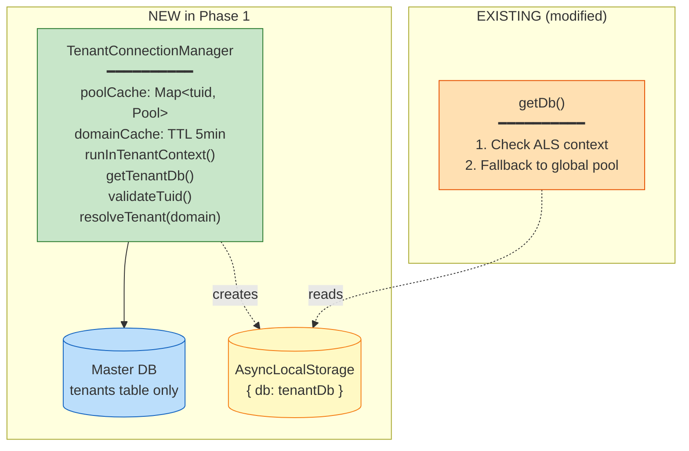

# Phase 1 — Master DB + TenantConnectionManager

> **Goal:** Introduce the master tenants registry and the per-tenant connection manager, with `getDb()` becoming `AsyncLocalStorage`-aware. **Behaviour gated by `MASTER_DATABASE_URL`** — without the flag, PMS runs identically to today.
> **Risk:** 🟡 Medium (`AsyncLocalStorage` correctness)
> **Estimated effort:** 1–2 PRs, ~1.5 weeks
> **Prerequisites:** Phase 0 complete
> **Unblocks:** Phase 2 (server middleware), Phase 3 (frontend) — both can start in parallel after this lands.

---

## 1. What this phase delivers



**No middleware yet** (that's Phase 2). **No frontend yet** (Phase 3). **No tenant requests served yet** (Phase 4). This phase only assembles the parts.

---

## 2. Files to create / modify

| Action | File | Purpose |
|---|---|---|
| ➕ Create | `shared/master/schema.ts` | `tenants` table only |
| ➕ Create | `migrations/master/0001_initial.sql` | Generated migration for master DB |
| ➕ Create | `drizzle.master.config.ts` | Separate Drizzle config for master schema |
| ➕ Create | `server/utils/tenantConnectionManager.ts` | The TCM class |
| ➕ Create | `server/utils/asyncLocalStorage.ts` | Single shared ALS instance |
| ✏️ Modify | `server/db.ts` | `getDb()` checks ALS first |
| ✏️ Modify | `server/postgresClient.ts` | New `resolveMasterPostgres()` helper |
| ✏️ Modify | `package.json` scripts | Add `db:generate:master` |
| ➕ Create | `server/__tests__/tenantConnectionManager.test.ts` | Concurrency test |

---

## 3. The master `tenants` schema

`shared/master/schema.ts`:

```typescript
import { pgTable, text, boolean, timestamp } from "drizzle-orm/pg-core";
import { sql } from "drizzle-orm";
import { createInsertSchema } from "drizzle-zod";
import { z } from "zod";
import { updatedAtColumn } from "../schemaHelpers";

export const tenants = pgTable("tenants", {
  tuid: text("tuid").primaryKey().default(sql`gen_random_uuid()::text`),
  domain: text("domain").notNull().unique(),       // e.g. "acme-shipping.example.com"
  companyName: text("company_name").notNull(),
  dbUrl: text("db_url").notNull(),                 // PostgreSQL connection string
  isActive: boolean("is_active").notNull().default(true),
  isDeleted: boolean("is_deleted").notNull().default(false),
  createdAt: timestamp("created_at").notNull().defaultNow(),
  updatedAt: updatedAtColumn(),
  createdByUuid: text("created_by_uuid"),
  updatedByUuid: text("updated_by_uuid"),
});

export const insertTenantSchema = createInsertSchema(tenants).omit({
  tuid: true, createdAt: true, updatedAt: true,
});
export type InsertTenant = z.infer<typeof insertTenantSchema>;
export type Tenant = typeof tenants.$inferSelect;
```

**Schema decisions** (per [`README.md §6.4`](./README.md)):
- `dbUrl` stored plaintext for now — encryption-at-rest deferred to a Phase 5 follow-up.
- `domain` is the lookup key matching `localStorage["domain"]` from the parent app.
- Same audit columns (`createdByUuid`, `updatedByUuid`, `isDeleted`) and `updatedAtColumn()` helper as the rest of PMS — keeps the project consistent.

### Generate the master migration

```bash
npm run db:generate:master
```

This needs a new `drizzle.master.config.ts`:

```typescript
import type { Config } from "drizzle-kit";
export default {
  schema: "./shared/master/schema.ts",
  out: "./migrations/master",
  dialect: "postgresql",
  dbCredentials: { url: process.env.MASTER_DATABASE_URL! },
} satisfies Config;
```

And a new script in `package.json` (this is the only `package.json` change in the whole multi-tenant migration — coordinate with the team):

```json
"db:generate:master": "drizzle-kit generate --config=drizzle.master.config.ts"
```

> **Migration policy:** master DB migrations follow the **same rules** as tenant DBs — `db:generate` → review → commit → applied at startup. **Never `db:push`** on a master DB that has tenants registered.

---

## 4. The shared AsyncLocalStorage instance

`server/utils/asyncLocalStorage.ts`:

```typescript
import { AsyncLocalStorage } from "node:async_hooks";
import type { drizzle } from "drizzle-orm/node-postgres";

export interface TenantContext {
  tuid: string;
  db: ReturnType<typeof drizzle>;
}

export const tenantStorage = new AsyncLocalStorage<TenantContext>();

export function getCurrentTenantContext(): TenantContext | undefined {
  return tenantStorage.getStore();
}
```

Single instance. Imported by `server/db.ts` AND `server/utils/tenantConnectionManager.ts`. Do **not** create a second ALS for any reason — context isolation depends on it being the same object.

---

## 5. The TenantConnectionManager

`server/utils/tenantConnectionManager.ts` — sketch:

```typescript
import { Pool } from "pg";
import { drizzle } from "drizzle-orm/node-postgres";
import { eq, and } from "drizzle-orm";
import * as schema from "@shared/schema";
import { tenants } from "@shared/master/schema";
import { tenantStorage, type TenantContext } from "./asyncLocalStorage";
import { runBackupAndMigrations } from "../migrations";
import { initializeDatabase, ensureMaintenanceHistoryImmutability } from "../initDb";

interface CachedDomain { tuid: string; companyName: string; expiresAt: number; }

export class TenantConnectionManager {
  private masterPool: Pool;
  private masterDb: ReturnType<typeof drizzle>;
  private poolCache = new Map<string, Pool>();
  private dbCache = new Map<string, ReturnType<typeof drizzle>>();
  private domainCache = new Map<string, CachedDomain>();
  private migratedTenants = new Set<string>();
  private readonly DOMAIN_TTL_MS = 5 * 60 * 1000;
  private readonly MAX_POOL_SIZE = 3;       // per-tenant cap
  private readonly MAX_TENANTS_CACHED = 50; // LRU cap

  constructor(masterUrl: string) {
    this.masterPool = new Pool({ connectionString: masterUrl, max: 5 });
    this.masterDb = drizzle(this.masterPool);
  }

  /** Resolve domain → tenant info; cached 5 min. */
  async resolveTenant(domain: string): Promise<{ tuid: string; companyName: string } | null> {
    const now = Date.now();
    const cached = this.domainCache.get(domain);
    if (cached && cached.expiresAt > now) {
      return { tuid: cached.tuid, companyName: cached.companyName };
    }
    const [row] = await this.masterDb
      .select({ tuid: tenants.tuid, companyName: tenants.companyName })
      .from(tenants)
      .where(and(eq(tenants.domain, domain), eq(tenants.isActive, true), eq(tenants.isDeleted, false)));
    if (!row) return null;
    this.domainCache.set(domain, { ...row, expiresAt: now + this.DOMAIN_TTL_MS });
    return row;
  }

  /** Verify a tuid corresponds to an active tenant. */
  async validateTuid(tuid: string): Promise<boolean> {
    const [row] = await this.masterDb.select({ tuid: tenants.tuid })
      .from(tenants)
      .where(and(eq(tenants.tuid, tuid), eq(tenants.isActive, true), eq(tenants.isDeleted, false)));
    return !!row;
  }

  /** Get (or create + migrate) a Drizzle db for a tenant. */
  async getTenantDb(tuid: string): Promise<ReturnType<typeof drizzle>> {
    if (this.dbCache.has(tuid)) return this.dbCache.get(tuid)!;

    const [row] = await this.masterDb.select({ dbUrl: tenants.dbUrl })
      .from(tenants).where(eq(tenants.tuid, tuid));
    if (!row) throw new Error(`Tenant ${tuid} not found`);

    const pool = new Pool({ connectionString: row.dbUrl, max: this.MAX_POOL_SIZE });
    const db = drizzle(pool, { schema });

    // Run migrations on first connection
    if (!this.migratedTenants.has(tuid)) {
      await ensureMaintenanceHistoryImmutability(pool);
      await runBackupAndMigrations(pool);
      await initializeDatabase(pool);
      this.migratedTenants.add(tuid);
    }

    this.evictIfNeeded();
    this.poolCache.set(tuid, pool);
    this.dbCache.set(tuid, db);
    return db;
  }

  /** Run a callback inside the tenant's ALS context. */
  async runInTenantContext<T>(tuid: string, cb: () => Promise<T>): Promise<T> {
    const db = await this.getTenantDb(tuid);
    return tenantStorage.run({ tuid, db }, cb);
  }

  private evictIfNeeded() {
    if (this.poolCache.size < this.MAX_TENANTS_CACHED) return;
    // Naive FIFO eviction — replace with proper LRU if needed
    const oldest = this.poolCache.keys().next().value;
    if (oldest) {
      this.poolCache.get(oldest)?.end();
      this.poolCache.delete(oldest);
      this.dbCache.delete(oldest);
    }
  }

  /** For graceful shutdown / tests. */
  async destroy() {
    await Promise.all([...this.poolCache.values()].map(p => p.end()));
    await this.masterPool.end();
    this.poolCache.clear();
    this.dbCache.clear();
    this.domainCache.clear();
  }
}

let instance: TenantConnectionManager | null = null;

export function getTenantManager(): TenantConnectionManager | null {
  if (!process.env.MASTER_DATABASE_URL) return null;
  if (!instance) instance = new TenantConnectionManager(process.env.MASTER_DATABASE_URL);
  return instance;
}
```

---

## 6. Make `getDb()` ALS-aware

Edit `server/db.ts`:

```typescript
import { getCurrentTenantContext } from "./utils/asyncLocalStorage";

export async function getDb() {
  // 1. If we're inside a tenant context, return that DB.
  const ctx = getCurrentTenantContext();
  if (ctx) return ctx.db;

  // 2. Otherwise, legacy single-tenant path.
  const postgres = await resolvePostgres();
  if (!postgres) throw new Error('PostgreSQL not available');
  return postgres.db;
}
```

This is the **lynchpin change**. Every existing `await getDb()` call across `postgresStorage.ts` and the converted module files now automatically targets the right database when a request runs inside `runInTenantContext`.

---

## 7. Master DB migration runner

When the server boots **and** `MASTER_DATABASE_URL` is set, we need to apply migrations to the master DB itself. Add to `server/index.ts:50` area:

```typescript
await runBackupAndMigrations();      // legacy global (single-tenant fallback)

if (process.env.MASTER_DATABASE_URL) {
  const masterPool = new Pool({ connectionString: process.env.MASTER_DATABASE_URL });
  await runMasterMigrations(masterPool);  // new: applies migrations/master/0001_initial.sql
  await masterPool.end();
}
```

`runMasterMigrations` is a thin variant of `runDrizzleMigrations` that points at `migrations/master/` instead of `migrations/`. Lives in `server/migrations.ts`.

---

## 8. Acceptance criteria

| # | Criterion | How to verify |
|---|---|---|
| 1 | Without `MASTER_DATABASE_URL`, app boots and serves identically to Phase 0 | Manual smoke test on dev environment |
| 2 | With `MASTER_DATABASE_URL` set, app boots, applies master migration, `tenants` table exists | `psql $MASTER_DATABASE_URL -c "\dt"` |
| 3 | Concurrency test: 50 parallel requests under different tenant contexts each query the right DB | `server/__tests__/tenantConnectionManager.test.ts` |
| 4 | `getDb()` called outside any context returns the legacy global pool | Unit test |
| 5 | `getDb()` called inside `runInTenantContext(tuid, cb)` returns the tenant DB | Unit test |
| 6 | Pool eviction kicks in at `MAX_TENANTS_CACHED` | Unit test that registers 51 fake tenants |
| 7 | First call to `getTenantDb(tuid)` runs migrations; second call does not | Integration test against a fresh tenant DB, assert `schema_migrations` table populated and idempotent |

---

## 9. The concurrency test (most important)

`server/__tests__/tenantConnectionManager.test.ts` — sketch:

```typescript
import { TenantConnectionManager } from "../utils/tenantConnectionManager";
import { tenantStorage } from "../utils/asyncLocalStorage";

test("ALS isolates tenant DB across concurrent requests", async () => {
  const tcm = new TenantConnectionManager(process.env.TEST_MASTER_URL!);
  // Pre-seed master with two test tenants A and B pointing at two test DBs.

  const results = await Promise.all(
    Array.from({ length: 50 }, (_, i) => {
      const tuid = i % 2 === 0 ? "tenantA" : "tenantB";
      return tcm.runInTenantContext(tuid, async () => {
        // Simulate awaits & event-loop yields
        await new Promise(r => setImmediate(r));
        const ctx = tenantStorage.getStore();
        return { expected: tuid, got: ctx?.tuid };
      });
    })
  );

  for (const r of results) expect(r.got).toBe(r.expected);
});
```

A failure here means context leakage — **show-stopper**. Do not move to Phase 2 until this is rock solid.

---

## 10. Risks & mitigations

| Risk | Mitigation |
|---|---|
| ALS context lost across `setTimeout`, `setInterval`, native callbacks | Test all known async patterns used by PMS; ALS handles `Promise`/`async` natively, but raw `EventEmitter` listeners bound outside the context window can leak. Document forbidden patterns. |
| Migrations on first connection slow down the request that triggered them | Acceptable for first hit; consider warm-up endpoint `POST /admin/warm-tenant/:tuid` for ops to call after onboarding |
| Pool count grows unbounded | `MAX_POOL_SIZE = 3` per tenant + `MAX_TENANTS_CACHED = 50` LRU cap; adjust based on prod observation |
| Race condition: two concurrent requests both trigger first-time migration | Wrap migration in `Promise.race` deduplication via an in-flight `Map<tuid, Promise<void>>` |
| `MASTER_DATABASE_URL` accidentally points at a tenant DB | TCM verifies `tenants` table exists during `instance` construction; throws if not |

---

## 11. Rollback plan

1. Unset `MASTER_DATABASE_URL` env var → app reverts to legacy single-tenant mode (no code change needed; the flag-gating ensures this works).
2. If absolutely needed, `git revert <Phase-1 PR>` — Phase 0's seam refactor stays.
3. Master DB itself can be dropped with no impact on tenant data (no FK relationships exist between master and tenant DBs).

---

## 12. Definition of Done

- [ ] `shared/master/schema.ts` created with `tenants` table.
- [ ] `migrations/master/0001_initial.sql` generated and committed.
- [ ] `drizzle.master.config.ts` and `db:generate:master` script wired.
- [ ] `server/utils/asyncLocalStorage.ts` exports the single shared `tenantStorage`.
- [ ] `server/utils/tenantConnectionManager.ts` implements all methods in §5.
- [ ] `server/db.ts` `getDb()` checks ALS context first.
- [ ] `server/index.ts` boot path runs master migrations when flag set.
- [ ] Concurrency test (§9) green with 50 iterations.
- [ ] Acceptance criteria 1–7 all green.
- [ ] PR merged.
