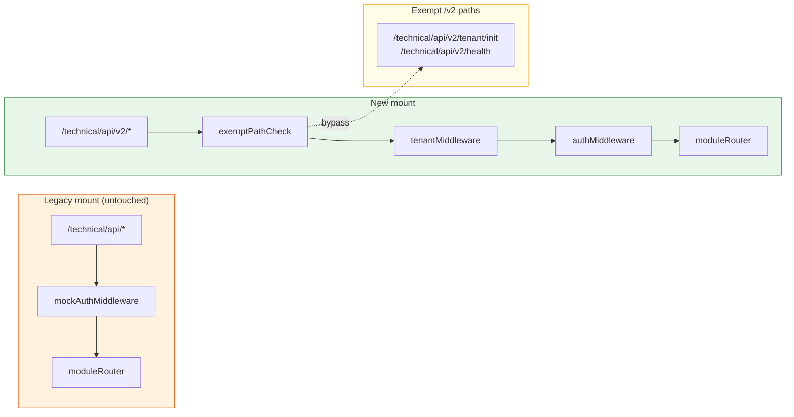

# Phase 2 — Server Middleware Chain

> **Goal:** Add `tenantMiddleware → authMiddleware` and mount the tenant-aware routes under `/technical/api/v2`. Legacy `/technical/api` routes remain untouched.
> **Risk:** 🟡 Medium (exempt-path list is a known foot-gun)
> **Estimated effort:** 1 PR, ~1 week
> **Prerequisites:** Phase 1 complete
> **Unblocks:** Phase 4

---

## 1. Goal

After this phase, two route prefixes coexist:



The same `moduleRouter` is mounted twice. That's intentional: it lets us cut over modules to `/v2` one at a time in Phase 4 without duplicating code.

---

## 2. Files to create / modify

| Action | File | Purpose |
|---|---|---|
| ➕ Create | `server/middleware/tenantMiddleware.ts` | Validate `x-tenant-id`, bind ALS |
| ➕ Create | `server/middleware/authMiddleware.ts` | Verify JWT, cross-check domain |
| ➕ Create | `server/middleware/exemptPaths.ts` | Path matcher for endpoints that skip tenant/auth |
| ➕ Create | `server/modules/tenant/routes.ts` | `POST /tenant/init`, `GET /health` |
| ✏️ Modify | `server/routes.ts` | Add `/v2` mount + `/tenant/init` (legacy `/technical/api` mount kept) |
| ✏️ Modify | `server/middleware/auth.ts` | Allow `mockAuthMiddleware` to recognise tenant context (forward-compat) |

---

## 3. Required environment variables

| Var | Required when | Notes |
|---|---|---|
| `JWT_SECRET` | `MASTER_DATABASE_URL` is set | Used by `authMiddleware` |
| `AUTH_BYPASS` | Dev only | When `=true`, both middlewares short-circuit; `req.user` populated from a default like `mockAuthMiddleware` |

**Behaviour matrix:**

| `MASTER_DATABASE_URL` | `AUTH_BYPASS` | `/v2` requests | `/technical/api` requests |
|---|---|---|---|
| unset | n/a | 503 (tenant manager unavailable) | Mock auth, current behaviour |
| set | `true` | Skip middleware, mock user | Mock auth, current behaviour |
| set | `false`/unset | Full tenant + JWT chain | Mock auth, current behaviour |

---

## 4. The exempt paths matcher

`server/middleware/exemptPaths.ts`:

```typescript
const EXEMPT_PATTERNS: RegExp[] = [
  /^\/technical\/api\/v2\/tenant\/init\/?$/,
  /^\/technical\/api\/v2\/health\/?$/,
];

export function isExemptPath(path: string): boolean {
  return EXEMPT_PATTERNS.some(re => re.test(path));
}
```

Keep this list **tiny** and explicit. Every entry is a potential cross-tenant leak vector.

---

## 5. The tenant middleware

`server/middleware/tenantMiddleware.ts`:

```typescript
import { Request, Response, NextFunction } from "express";
import { getTenantManager } from "../utils/tenantConnectionManager";
import { isExemptPath } from "./exemptPaths";

export async function tenantMiddleware(req: Request, res: Response, next: NextFunction) {
  if (isExemptPath(req.path)) return next();

  if (process.env.AUTH_BYPASS === "true") {
    // Dev escape hatch — must still bind a tenant context if MASTER_DATABASE_URL is set
    const devTuid = process.env.DEV_TENANT_TUID;
    if (!devTuid) return next();
    const tcm = getTenantManager();
    if (!tcm) return next();
    return tcm.runInTenantContext(devTuid, () => Promise.resolve(next()));
  }

  const tenantId = req.headers["x-tenant-id"];
  const tuid = Array.isArray(tenantId) ? tenantId[0] : tenantId;

  if (!tuid) {
    return res.status(400).json({ error: "Missing x-tenant-id header" });
  }

  const tcm = getTenantManager();
  if (!tcm) {
    return res.status(503).json({ error: "Multi-tenant mode not configured" });
  }

  const valid = await tcm.validateTuid(tuid);
  if (!valid) {
    return res.status(403).json({ error: "Unknown or inactive tenant" });
  }

  // Bind ALS context for the rest of the request chain
  return tcm.runInTenantContext(tuid, () => new Promise<void>((resolve, reject) => {
    next();
    res.on("finish", resolve);
    res.on("close", resolve);
    res.on("error", reject);
  }));
}
```

**Critical detail:** `runInTenantContext` must wrap the **entire downstream chain**, not just the synchronous `next()` call. The Promise-wrapped pattern above guarantees the ALS scope stays alive until the response finishes, so any `await getDb()` inside route handlers (even deep in async stacks) sees the right context.

---

## 6. The auth middleware

`server/middleware/authMiddleware.ts`:

```typescript
import { Request, Response, NextFunction } from "express";
import jwt from "jsonwebtoken";
import { isExemptPath } from "./exemptPaths";

export interface AuthenticatedRequest extends Request {
  user?: {
    userUuid: string;
    fullName: string;
    role: string;
    domain: string;
    rank_name?: string;
  };
}

export async function authMiddleware(req: AuthenticatedRequest, res: Response, next: NextFunction) {
  if (isExemptPath(req.path)) return next();

  if (process.env.AUTH_BYPASS === "true") {
    req.user = {
      userUuid: "00000000-0000-0000-0000-000000000001",
      fullName: "Dev Admin",
      role: "Sail Admin",
      domain: "dev.local",
      rank_name: (req.headers["x-rank"] as string) || "Chief Engineer",
    };
    return next();
  }

  const authHeader = req.headers.authorization;
  if (!authHeader?.startsWith("Bearer ")) {
    return res.status(401).json({ error: "Missing or malformed Authorization header" });
  }
  const token = authHeader.slice(7);

  try {
    const payload = jwt.verify(token, process.env.JWT_SECRET!) as any;

    // Cross-check JWT.domain against the tenant we already validated.
    // (Optional but recommended — prevents replay of a JWT across tenants.)
    const expectedDomain = req.headers["x-tenant-domain"];
    if (expectedDomain && payload.domain !== expectedDomain) {
      return res.status(403).json({ error: "JWT/tenant domain mismatch" });
    }

    req.user = {
      userUuid: payload.userUuid,
      fullName: payload.fullName,
      role: payload.role,
      domain: payload.domain,
      rank_name: (req.headers["x-rank"] as string) || payload.rank_name,
    };
    return next();
  } catch (err: any) {
    return res.status(401).json({ error: "Invalid or expired token" });
  }
}
```

**Why `x-rank` still wins:** PMS's existing rank-impersonation feature (used by QA) overrides the rank claim from JWT. This preserves Q4 in the [Decision Log](./README.md#7-decision-log-open-questions) — keep `x-rank` for QA convenience.

---

## 7. The `tenant/init` endpoint

`server/modules/tenant/routes.ts`:

```typescript
import { Router } from "express";
import { z } from "zod";
import { getTenantManager } from "../../utils/tenantConnectionManager";

const router = Router();

router.get("/health", (_req, res) => res.json({ ok: true }));

const initSchema = z.object({ domain: z.string().min(1) });

router.post("/init", async (req, res) => {
  const parsed = initSchema.safeParse(req.body);
  if (!parsed.success) return res.status(400).json({ error: parsed.error.message });

  const tcm = getTenantManager();
  if (!tcm) return res.status(503).json({ error: "Multi-tenant not configured" });

  const tenant = await tcm.resolveTenant(parsed.data.domain);
  if (!tenant) return res.status(404).json({ error: "No tenant for this domain" });

  return res.json({ tenantId: tenant.tuid, companyName: tenant.companyName });
});

export default router;
```

**Note:** this endpoint is exempt from `tenantMiddleware`/`authMiddleware` (because the client doesn't yet know the tuid when calling it). It is the **only** endpoint that hits the master DB from the request path.

---

## 8. Wiring in `server/routes.ts`

Modify `server/routes.ts:24-31`:

```typescript
// === existing single-tenant mount (kept for back-compat through Phase 4) ===
await initMockAuthRankId();
app.use('/technical/api', mockAuthMiddleware);
console.log('🔒 Mock authentication enabled for /technical/api/* routes');
app.use('/technical/api', moduleRouter);

// === new multi-tenant mount (Phase 2+) ===
if (process.env.MASTER_DATABASE_URL) {
  const tenantRoutes = (await import('./modules/tenant/routes')).default;
  const { tenantMiddleware } = await import('./middleware/tenantMiddleware');
  const { authMiddleware } = await import('./middleware/authMiddleware');

  // Exempt routes mounted FIRST, before middleware
  app.use('/technical/api/v2/tenant', tenantRoutes);

  // All other v2 routes go through the chain
  app.use('/technical/api/v2', tenantMiddleware, authMiddleware, moduleRouter);
  console.log('🔒 Multi-tenant routes enabled at /technical/api/v2/*');
}
```

**Mount order is critical.** Express matches in registration order — `/v2/tenant` must be registered before the catch-all `/v2` mount, otherwise the middleware will run on `/tenant/init` and reject for missing `x-tenant-id`.

---

## 9. Acceptance criteria

| # | Criterion | How to verify |
|---|---|---|
| 1 | Without `MASTER_DATABASE_URL`, `/v2/*` routes return 404 (mount not registered) | `curl /technical/api/v2/work-orders` |
| 2 | With flag set, `POST /technical/api/v2/tenant/init {domain}` returns `{tenantId, companyName}` for a registered tenant | `curl` with seeded master |
| 3 | `/v2/work-orders` without `x-tenant-id` returns 400 | `curl` |
| 4 | `/v2/work-orders` with valid `x-tenant-id` but no `Authorization` returns 401 | `curl` |
| 5 | `/v2/work-orders` with both headers and a valid JWT returns the tenant's data | Integration test |
| 6 | `/technical/api/work-orders` (legacy) keeps working with `x-rank` only | Existing E2E test should still pass |
| 7 | With `AUTH_BYPASS=true`, no headers required on `/v2/*` | Dev convenience |
| 8 | `tenantMiddleware` does NOT execute on `/v2/tenant/init` (no infinite recursion) | Trace logs during test |

---

## 10. Test plan

### 10.1 Unit
- `tenantMiddleware`: missing header → 400; unknown tuid → 403; valid → calls `next()` inside ALS context.
- `authMiddleware`: missing `Authorization` → 401; bad signature → 401; good token → `req.user` populated; bypass mode → mock user.
- `isExemptPath`: covers `/v2/tenant/init`, rejects everything else.

### 10.2 Integration
- Seed master DB with one tenant pointing at the dev tenant DB.
- Hit `POST /v2/tenant/init` with the dev domain → receive `tenantId`.
- Hit `GET /v2/vessels` with that `tenantId` + a self-signed JWT → receive vessel list.
- Hit `GET /vessels` (legacy) → still works.

### 10.3 Concurrency
- Fire 100 parallel requests across 5 tenants and verify no cross-contamination of returned data.

---

## 11. Risks & mitigations

| Risk | Mitigation |
|---|---|
| Forgotten exempt route → entire feature unreachable | All exempt paths centralised in `exemptPaths.ts`, code-reviewed line-by-line |
| Mount order wrong → `/v2/tenant/init` falls through middleware | Smoke test in CI hits `/v2/tenant/init` and asserts no `x-tenant-id` was required |
| `runInTenantContext` Promise wrapping doesn't await `res.on('finish')` properly → ALS evicted before downstream `await getDb()` resolves | Phase 1 concurrency test catches this; add a regression test that does `await new Promise(r => setTimeout(r, 50))` then `getDb()` |
| Both `mockAuthMiddleware` AND new `authMiddleware` run on a route by accident | Explicit mount paths — `mockAuthMiddleware` only on `/technical/api`, `authMiddleware` only on `/technical/api/v2` |
| `JWT_SECRET` mismatch with parent app → all requests 401 | Ops runbook: confirm secret value matches Crewing's deployment; smoke test on staging first |

---

## 12. Rollback plan

1. Unset `MASTER_DATABASE_URL` — `/v2` mount disappears, legacy paths unchanged.
2. Or `git revert <Phase-2 PR>` — Phase 1 stays in place, app reverts to single-tenant.

---

## 13. Definition of Done

- [ ] `tenantMiddleware`, `authMiddleware`, `exemptPaths` all created.
- [ ] `POST /technical/api/v2/tenant/init` and `GET /technical/api/v2/health` reachable.
- [ ] `/v2/*` mount registered conditionally on `MASTER_DATABASE_URL`.
- [ ] Legacy `/technical/api/*` mount unchanged.
- [ ] Acceptance criteria 1–8 green.
- [ ] Manual smoke test passed on staging with one seeded tenant.
- [ ] Concurrency test from §10.3 green.
- [ ] PR merged.
