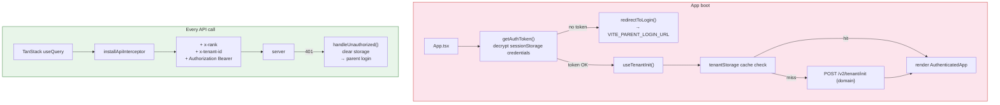

# Phase 3 — Frontend Tenant Layer

> **Goal:** Bring the React app online with parent-app JWT decryption, tenant init, and a unified fetch interceptor that injects `x-tenant-id` + `Authorization` (alongside the existing `x-rank`).
> **Risk:** 🟡 Medium (consolidating two interceptors)
> **Estimated effort:** 1–2 PRs, ~1.5 weeks
> **Prerequisites:** Phase 1 complete (Phase 2 helpful but not strictly required — frontend can be developed against `AUTH_BYPASS=true` server)
> **Unblocks:** Phase 4 (cut-over)

---

## 1. Goal



PMS already has the AES building block (`client/src/utils/secureStorage.ts` using `CryptoJS` and `VITE_STORAGE_SECRET`). We reuse it.

---

## 2. Files to create / modify

| Action | File | Purpose |
|---|---|---|
| ➕ Create | `client/src/lib/tenantStorage.ts` | AES `getTenantId/setTenantId/getTenantDomain/setTenantDomain` |
| ➕ Create | `client/src/lib/authToken.ts` | Decrypt `sessionStorage["credentials"]`, redirect helpers |
| ➕ Create | `client/src/lib/tenantFetch.ts` | Single fetch interceptor (replaces `activeRank` interceptor) |
| ➕ Create | `client/src/hooks/useTenantInit.ts` | Resolve domain → tuid, cache it |
| ➕ Create | `client/src/components/TenantInitGate.tsx` | Loading/error UI while tenant resolves |
| ✏️ Modify | `client/src/App.tsx` | Auth guard + `useTenantInit` wrapper |
| ✏️ Modify | `client/src/lib/queryClient.ts` | Replace `installRankFetchInterceptor` with `installApiInterceptor` |
| ✏️ Modify | `client/src/lib/activeRank.ts` | Keep `activeRank` state but delete the interceptor (migrated into `tenantFetch.ts`) |
| ➕ Create (env) | `.env.example` additions | Document new VITE_ vars |

---

## 3. Required environment variables

| Var | Purpose | Default for dev |
|---|---|---|
| `VITE_AUTH_BYPASS` | Skip auth/tenant resolution on the client | `true` |
| `VITE_PARENT_LOGIN_URL` | Where to redirect on logout / 401 | `http://localhost:3000/login` |
| `VITE_CLIENT_ENCRYPTION_KEY` | AES key matching parent app's encryption (alias of existing `VITE_STORAGE_SECRET` to keep one secret) | reuse `VITE_STORAGE_SECRET` |
| `VITE_API_BASE` (optional) | Override server URL in dev | `''` (same origin) |

---

## 4. `tenantStorage`

`client/src/lib/tenantStorage.ts`:

```typescript
import { secureGet, secureSet, secureRemove } from "@/utils/secureStorage";

const KEY_TUID = "pms.tenantId";
const KEY_DOMAIN = "pms.tenantDomain";

export const tenantStorage = {
  getTenantId: (): string | null => secureGet(KEY_TUID),
  setTenantId: (tuid: string) => secureSet(KEY_TUID, tuid),
  getTenantDomain: (): string | null => secureGet(KEY_DOMAIN),
  setTenantDomain: (domain: string) => secureSet(KEY_DOMAIN, domain),
  clear: () => { secureRemove(KEY_TUID); secureRemove(KEY_DOMAIN); },
};
```

Reuses the project's existing `secureStorage.ts`. **Do not introduce a second AES helper** — the parent SAIL-Audits app and PMS must agree on the encryption library, mode, and IV strategy.

---

## 5. `authToken`

`client/src/lib/authToken.ts`:

```typescript
import { secureGetSession, secureClearSession } from "@/utils/secureStorage";
import { tenantStorage } from "./tenantStorage";

const SESSION_KEY_CREDS = "credentials";

export function getAuthToken(): string | null {
  if (import.meta.env.VITE_AUTH_BYPASS === "true") return "dev-bypass-token";
  return secureGetSession(SESSION_KEY_CREDS);
}

export function getDomain(): string | null {
  // Parent app stores domain in localStorage (per Crewing pattern)
  return secureGetSession("domain") ?? localStorage.getItem("domain");
}

export function redirectToLogin(): never {
  secureClearSession();
  tenantStorage.clear();
  const url = import.meta.env.VITE_PARENT_LOGIN_URL || "/";
  window.location.href = url;
  throw new Error("Redirecting to login");
}

export function handleUnauthorized(): void {
  if (import.meta.env.VITE_AUTH_BYPASS === "true") return;
  redirectToLogin();
}
```

**Note:** `secureStorage.ts` may need a small extension to add `secureGetSession`/`secureClearSession` (sessionStorage variants) — review existing API before duplicating.

---

## 6. `tenantFetch` — the unified interceptor

This is the **delicate** file. Today PMS has `installRankFetchInterceptor` in `client/src/lib/activeRank.ts`. We replace it with one interceptor that handles all three headers and 401 logout.

`client/src/lib/tenantFetch.ts`:

```typescript
import { getAuthToken, handleUnauthorized } from "./authToken";
import { tenantStorage } from "./tenantStorage";
import { getActiveRank } from "./activeRank";   // re-export from existing file

const API_PREFIX = "/technical/api/";    // matches both legacy and /v2

let installed = false;

export function installApiInterceptor() {
  if (installed) return;
  installed = true;
  const originalFetch = window.fetch.bind(window);

  window.fetch = async (input, init = {}) => {
    const url = typeof input === "string" ? input : (input as Request).url;
    if (!url.includes(API_PREFIX)) return originalFetch(input, init);

    const headers = new Headers(init.headers || (typeof input !== "string" ? (input as Request).headers : undefined));

    // 1. x-rank (existing behaviour, preserved)
    const rank = getActiveRank();
    if (rank && !headers.has("x-rank")) headers.set("x-rank", rank);

    // 2. x-tenant-id (new)
    const tuid = tenantStorage.getTenantId();
    if (tuid && !headers.has("x-tenant-id")) headers.set("x-tenant-id", tuid);

    // 3. Authorization (new)
    const token = getAuthToken();
    if (token && !headers.has("Authorization")) headers.set("Authorization", `Bearer ${token}`);

    const response = await originalFetch(input, { ...init, headers });

    if (response.status === 401 && url.includes("/v2/")) {
      handleUnauthorized();
    }
    return response;
  };
}
```

**Critical design choices:**
- **One interceptor, not two.** Composing two `window.fetch` wrappers is fragile; the second wrap loses access to the original `fetch`. Consolidate.
- **`if (!headers.has(...))` guards** preserve any explicit headers passed by callers (used in tests and by `apiRequest`).
- **401 handling only on `/v2/*`** — legacy `/technical/api/*` routes still rely on mock auth and shouldn't trigger logout.

### Update `queryClient.ts`

`client/src/lib/queryClient.ts`:

```typescript
import { installApiInterceptor } from "./tenantFetch";
installApiInterceptor();   // replaces installRankFetchInterceptor
// … rest unchanged
```

### Trim `activeRank.ts`

Keep the `getActiveRank` / `setActiveRank` state but delete `installRankFetchInterceptor` — it lives in `tenantFetch.ts` now. Add a JSDoc note to avoid confusion.

---

## 7. `useTenantInit`

`client/src/hooks/useTenantInit.ts`:

```typescript
import { useEffect, useState } from "react";
import { tenantStorage } from "@/lib/tenantStorage";
import { getDomain } from "@/lib/authToken";
import { apiRequest } from "@/lib/queryClient";

type State =
  | { status: "idle" }
  | { status: "loading" }
  | { status: "ready"; tenantId: string; companyName: string }
  | { status: "error"; message: string };

export function useTenantInit() {
  const [state, setState] = useState<State>({ status: "idle" });

  useEffect(() => {
    let cancelled = false;
    (async () => {
      setState({ status: "loading" });
      const domain = getDomain();
      if (!domain) {
        setState({ status: "error", message: "No domain in session" });
        return;
      }

      // Cache hit?
      const cachedTuid = tenantStorage.getTenantId();
      const cachedDomain = tenantStorage.getTenantDomain();
      if (cachedTuid && cachedDomain === domain) {
        setState({ status: "ready", tenantId: cachedTuid, companyName: "" });
        return;
      }

      try {
        const res = await apiRequest("POST", "/technical/api/v2/tenant/init", { domain });
        const data = await res.json();
        tenantStorage.setTenantId(data.tenantId);
        tenantStorage.setTenantDomain(domain);
        if (!cancelled) setState({ status: "ready", tenantId: data.tenantId, companyName: data.companyName });
      } catch (err: any) {
        if (!cancelled) setState({ status: "error", message: err.message });
      }
    })();
    return () => { cancelled = true; };
  }, []);

  return state;
}
```

---

## 8. The boot guard

`client/src/components/TenantInitGate.tsx`:

```typescript
import { useTenantInit } from "@/hooks/useTenantInit";
import { getAuthToken, redirectToLogin } from "@/lib/authToken";

export function TenantInitGate({ children }: { children: React.ReactNode }) {
  // Auth guard first
  if (!getAuthToken()) redirectToLogin();

  // In bypass mode, skip tenant init
  if (import.meta.env.VITE_AUTH_BYPASS === "true") return <>{children}</>;

  const state = useTenantInit();

  if (state.status === "loading" || state.status === "idle") {
    return <div data-testid="tenant-init-loading">Initializing tenant…</div>;
  }
  if (state.status === "error") {
    return (
      <div data-testid="tenant-init-error" className="p-8 text-red-600">
        Tenant initialization failed: {state.message}
      </div>
    );
  }
  return <>{children}</>;
}
```

Wire into `client/src/App.tsx`:

```tsx
import { TenantInitGate } from "@/components/TenantInitGate";

export default function App() {
  return (
    <QueryClientProvider client={queryClient}>
      <TenantInitGate>
        <ExistingProviders>
          <Router />
        </ExistingProviders>
      </TenantInitGate>
    </QueryClientProvider>
  );
}
```

---

## 9. Acceptance criteria

| # | Criterion | How to verify |
|---|---|---|
| 1 | With `VITE_AUTH_BYPASS=true`, app loads identically to today; existing pages work | Manual smoke |
| 2 | With bypass off and no `sessionStorage["credentials"]`, app redirects to `VITE_PARENT_LOGIN_URL` | Manual: clear storage, reload |
| 3 | With token present and unknown domain, error UI shown ("Tenant initialization failed") | Manual with bad domain |
| 4 | With token + valid domain, tenant init succeeds; `tenantStorage.getTenantId()` populated; subsequent requests carry all 3 headers | DevTools network tab |
| 5 | A 401 from `/v2/*` triggers logout; a 401 from `/technical/api/*` does NOT | Stub server response |
| 6 | `x-rank` impersonation still works on legacy and `/v2` routes | Existing rank-switch UI |
| 7 | Refresh on a deep-linked page (e.g. `/work-orders/123`) survives — re-runs init from cache | Manual |

---

## 10. Test plan

### 10.1 Unit
- `tenantStorage.set/get/clear` round-trip.
- `installApiInterceptor`: stub `fetch`, fire request to `/technical/api/foo`, assert all 3 headers added.
- `installApiInterceptor`: 401 on `/v2/foo` → `handleUnauthorized` called once.

### 10.2 Component
- `TenantInitGate` loading state, error state, ready state (with mocked `useTenantInit`).

### 10.3 E2E (Playwright or similar)
- Bypass mode: app boots and dashboard renders.
- No-token mode: redirect happens within 1 s.
- Bad-domain mode: error UI appears, no infinite loop.

---

## 11. Risks & mitigations

| Risk | Mitigation |
|---|---|
| Two interceptors fight over `window.fetch` (e.g. dev tools, MSW) | `installed` flag in `tenantFetch.ts`; document the wrap order |
| AES key mismatch between parent and PMS → can't decrypt credentials → infinite redirect loop | `redirectToLogin` clears storage but a missing token then triggers another redirect; **break the loop** by checking `document.referrer` and showing an error page if we just came from the login URL |
| Refresh after tenant init clears React state but cache survives → flicker | Cached tuid is read synchronously in `useTenantInit`'s effect; only show loading on cache miss |
| `apiRequest` POST to `/v2/tenant/init` fails because server requires `x-tenant-id` | Server's `exemptPaths.ts` lists this path explicitly; verify in Phase 2 acceptance |
| Unit tests that stub `fetch` break because of the global wrap | Reset wrap in test teardown by saving the original `window.fetch` |

---

## 12. Rollback plan

1. Set `VITE_AUTH_BYPASS=true` and rebuild — frontend behaves as today.
2. Or revert the PR; the legacy `installRankFetchInterceptor` can be restored from git history.

---

## 13. Definition of Done

- [ ] All 5 new client files created.
- [ ] `installApiInterceptor` replaces `installRankFetchInterceptor` in `queryClient.ts`.
- [ ] `App.tsx` wraps the tree in `TenantInitGate`.
- [ ] `.env.example` updated with new VITE_ vars.
- [ ] Bypass mode: app loads identically to today.
- [ ] Non-bypass mode (with seeded tenant): full boot + tenant init flow works against the Phase 2 server.
- [ ] Acceptance criteria 1–7 green.
- [ ] No existing test broken.
- [ ] PR merged.
