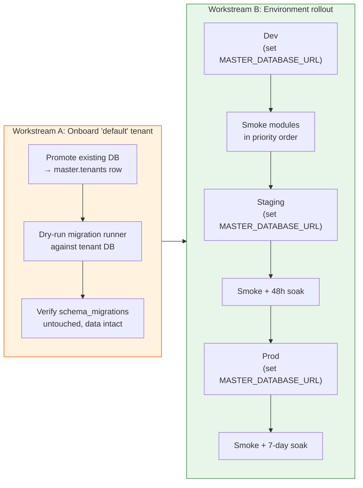

# Phase 4 — Per-Tenant Migrations + Environment Cut-over

> **Goal:** Promote the existing prod database into the master registry as the "default" tenant, exercise the per-tenant migration path, then turn on multi-tenant mode environment-by-environment (dev → staging → prod). Smoke-test each module in priority order after the flip in each environment.
> **Risk:** 🔴 High (live data; the flip is per environment, not per route)
> **Estimated effort:** 4–6 PRs / ops actions, ~3 weeks of soak time
> **Prerequisites:** Phases 0–3 complete and shipped to dev
> **Unblocks:** Phase 5

---

## 1. The shape of this phase

PMS has a **single API surface** — `/technical/api/*`. There is no parallel `/v2` route prefix to flip per module. Cut-over is therefore:

1. **Onboarding workstream:** make the existing prod DB look like a tenant in the master registry, and prove the per-tenant migration runner is a no-op against it.
2. **Environment rollout workstream:** turn on `MASTER_DATABASE_URL` in dev, then staging, then prod. After each flip, smoke-test the modules in a predetermined priority order so any regression is caught on the lowest-blast-radius surface first.



**Why environment-by-environment?** With a single mount point, there is no clean way to flip "just one module" — turning on `MASTER_DATABASE_URL` flips the entire API stack at once for that environment. The unit of risk is therefore the environment, not the module. We mitigate by promoting through dev → staging → prod with soak windows in between, and by smoke-testing modules in least-critical-first order so any regression in tenant resolution surfaces on Components or Reports rather than on Work Orders.

---

## 2. Workstream A — Onboard the "default" tenant

### 2.1 The promotion script

`scripts/promote-to-tenant.ts`:

```typescript
import { Pool } from "pg";
import { drizzle } from "drizzle-orm/node-postgres";
import { tenants } from "@shared/master/schema";

const MASTER_URL = process.env.MASTER_DATABASE_URL!;
const TENANT_URL = process.env.PROMOTE_TENANT_URL ?? process.env.DATABASE_URL!;
const DOMAIN = process.env.PROMOTE_TENANT_DOMAIN!;
const COMPANY = process.env.PROMOTE_TENANT_COMPANY ?? "Default Tenant";

(async () => {
  const masterPool = new Pool({ connectionString: MASTER_URL });
  const masterDb = drizzle(masterPool);

  const existing = await masterDb.select().from(tenants).where(/* eq(tenants.domain, DOMAIN) */);
  if (existing.length > 0) {
    console.log(`Tenant for domain ${DOMAIN} already exists: ${existing[0].tuid}`);
    await masterPool.end();
    return;
  }

  const [created] = await masterDb.insert(tenants).values({
    domain: DOMAIN,
    companyName: COMPANY,
    dbUrl: TENANT_URL,
    isActive: true,
  }).returning({ tuid: tenants.tuid });

  console.log(`✅ Registered tenant ${created.tuid} for domain ${DOMAIN}`);
  console.log(`   db_url = ${TENANT_URL}`);
  await masterPool.end();
})();
```

Run once per environment, **before** flipping `MASTER_DATABASE_URL` in that environment:

```bash
MASTER_DATABASE_URL="$STAGING_MASTER_URL" \
PROMOTE_TENANT_DOMAIN="staging.sail.example.com" \
PROMOTE_TENANT_COMPANY="Sail Maritime (Staging)" \
PROMOTE_TENANT_URL="$STAGING_DATABASE_URL" \
npx tsx scripts/promote-to-tenant.ts
```

**Idempotent.** Safe to re-run.

### 2.2 The first multi-tenant request — migration moment of truth

When the first multi-tenant request arrives (after `MASTER_DATABASE_URL` is set and the server is restarted), `TenantConnectionManager.getTenantDb(tuid)` runs:

1. Open a new pool against `tenant.db_url` (which is the **same** `DATABASE_URL` the environment was already using).
2. Call `ensureMaintenanceHistoryImmutability(pool)` — already idempotent.
3. Call `runBackupAndMigrations(pool)` — checks `schema_migrations`, sees every migration already applied, applies nothing.
4. Call `initializeDatabase(pool)` — idempotent reseeds.
5. Cache the pool.

**The danger:** if `runBackupAndMigrations` accidentally re-applies a migration, data corruption. Mitigations:

- Phase 0 already proved the pool-aware path works on a fresh DB.
- For the existing prod DB, run a **dry run** first: a script that connects as `getTenantDb` would but only **lists** what migrations would run (must be: none).

### 2.3 The dry-run script

`scripts/dry-run-tenant-migrations.ts`:

```typescript
// Connect to tenant DB, query schema_migrations, list which Drizzle and hand-written
// files have NOT been applied. Print, do not apply. Used as a Phase 4 gate.
```

**Acceptance gate before flipping `MASTER_DATABASE_URL` in any environment:** dry run prints **zero pending migrations** for that environment's DB.

### 2.4 Per-tenant audit log

Add an admin endpoint `GET /technical/api/admin/tenant-health` (gated by the `Sail Admin` role):

```json
{
  "tenants": [
    {
      "tuid": "abc-123",
      "companyName": "Default",
      "isActive": true,
      "lastConnected": "2026-04-24T09:00:00Z",
      "migrationsApplied": 142,
      "migrationsPending": 0,
      "poolSize": 3,
      "lastError": null
    }
  ]
}
```

Backed by an in-memory map maintained by `TenantConnectionManager` plus a query against each tenant's `schema_migrations`. Polled by ops dashboard.

---

## 3. Workstream B — Environment rollout

### 3.1 Environment promotion order

| # | Environment | Flip action | Soak window before next stage |
|---|---|---|---|
| 1 | Dev | Set `MASTER_DATABASE_URL` + `JWT_SECRET`; restart | Same-day smoke + overnight soak |
| 2 | Staging | Run promotion script; set env vars; restart | ≥48 h soak with synthetic traffic |
| 3 | Prod | Run promotion script; set env vars; deploy with restart window | ≥7 d soak before Phase 5 |

Each environment's flip is a **single deploy event** — there is no module-level toggle. What we **do** vary per environment is the smoke-test order after the flip (§3.2), so regressions surface on the safest surface first.

### 3.2 Post-flip smoke test order (least → most critical)

After flipping `MASTER_DATABASE_URL` in any environment, exercise the modules in this order. If any module fails, **stop, diagnose, and consider rolling back the env var** before moving on. The order is about which screen you click first, not about which routes are flipped.

| # | Module | Server location | Why this position |
|---|---|---|---|
| 1 | Components | `server/modules/components/` | Read-mostly; ideal smoke-test for the chain |
| 2 | Reports | `server/modules/reports/` | Read-only; safe canary |
| 3 | Spares | `server/modules/spares/` | Inventory, isolated domain |
| 4 | Stores | `server/modules/stores/` | Inventory, isolated domain |
| 5 | Defects | `server/modules/defects/` | Wizard-heavy; broad UI surface |
| 6 | Work Orders + Running Hours | `server/modules/work-orders/`, `server/modules/running-hours/` | Heart of PMS — exercise together as they share state |
| 7 | Noon Report | `server/modules/noon-report/` | Most direct-import files even after Phase 0; double-check |
| 8 | Access Control + Admin | `server/modules/access-control/` and admin routes | Last, because it controls who can see anything |

### 3.3 Per-module smoke recipe

For each module, after the env-var flip:

1. Confirm the module's listing page loads in the browser.
2. Confirm DevTools shows requests carrying `x-tenant-id` + `Authorization` (Phase 3 wiring).
3. Perform one CRUD round-trip per module (e.g. create one component, edit it, delete it).
4. Confirm server logs show requests resolving to the right `tuid` and the correct tenant DB pool.
5. Hit `/technical/api/admin/tenant-health` — confirm `migrationsPending: 0` and `lastError: null`.

### 3.4 Side-by-side parity harness (dev only)

Before promoting to staging, run a parity diff in dev:

1. Boot one server instance with `MASTER_DATABASE_URL` **unset** (single-tenant mock-auth path) on port A.
2. Boot a second instance with `MASTER_DATABASE_URL` **set** and the existing DB promoted as the default tenant on port B.
3. Both instances point at the **same** underlying tenant DB.
4. For each GET endpoint in the priority list, hit both ports and diff the response bodies (modulo timestamps).

If diffs are empty across all 8 modules, Workstream B is safe to promote to staging.

---

## 4. Schema gotcha — `vessels`, `users`, `fleets`

These three tables are in the per-tenant DB (Q3 default). After promoting the existing DB:

- All current `vessels`, `users`, `fleets` rows belong to the "default" tenant.
- A second tenant's database starts **empty** for these tables — they need their own seed data on onboarding.
- Cross-references stay clean because each tenant DB is fully self-contained.

If Q3 is decided differently (vessels in master), this phase needs an extra **data-migration step** to move the rows. Defer until Q3 is answered.

---

## 5. Acceptance criteria for the phase

| # | Criterion | How to verify |
|---|---|---|
| 1 | `scripts/promote-to-tenant.ts` registers each environment's DB as `default` tenant successfully | Run script per env, query `master.tenants` |
| 2 | `dry-run-tenant-migrations.ts` reports 0 pending against each env's DB before its flip | Run script per env |
| 3 | After flipping `MASTER_DATABASE_URL` in dev, the parity harness from §3.4 reports empty diffs across all 8 modules | Run harness |
| 4 | After flipping in staging, all 8 modules pass the smoke recipe (§3.3) and 48 h soak shows 0 errors attributable to tenant resolution | Manual smoke + ops dashboard |
| 5 | After flipping in prod, 7-day soak shows 0 5xx attributable to tenant/auth | Monitoring |
| 6 | `tenant_health` endpoint shows `migrationsApplied = N`, `migrationsPending = 0`, `lastError = null` for the default tenant in every environment after the flip | curl |
| 7 | Pool count at steady state ≤ 3 (one tenant) and stays bounded | Postgres `pg_stat_activity` |
| 8 | Single-tenant rollback path verified in dev: unset `MASTER_DATABASE_URL`, restart, all routes work on mock auth as before | Manual |

---

## 6. Risks & mitigations

| Risk | Severity | Mitigation |
|---|---|---|
| Per-tenant migration runner re-applies a migration on the existing prod DB | **Critical** | Dry-run gate (§2.3); manual review of `schema_migrations` before flipping prod |
| Flipping `MASTER_DATABASE_URL` in prod breaks every module at once because there is no per-route toggle | **High** | Mandatory dev parity harness (§3.4) and ≥48 h staging soak before prod; rollback is "unset env var + restart" |
| Onboarding a second tenant later fails because seed data scripts assume single-tenant | Medium | Document seed scripts as "per-tenant"; convert any global `INSERT` in `initDb.ts` to per-tenant |
| `tenant_health` endpoint accidentally reachable without auth → leaks tenant inventory | Medium | Mount under `/technical/api/admin/tenant-health` and require `Sail Admin` role |
| Background services (alerts engine, schedulers) run outside any HTTP request → no ALS context → fail silently after the flip | High | Phase 4.5 deliverable (called out in Phase 5 §6): every background loop wraps its work in `tcm.runInTenantContext(tuid, …)` for each active tenant. **Must be done before flipping prod.** |
| Concurrent requests for different tenants leak across the ALS boundary | **Critical** | Phase 1 concurrency suite is the gate; re-run against the staging deploy before prod flip |

---

## 7. Rollback plan

**Per-environment rollback (any stage):**
1. Unset `MASTER_DATABASE_URL` in that environment.
2. Restart the server — it boots back into single-tenant mode with mock auth (Phase 2 §12).
3. The frontend continues to work because the API surface is unchanged; clients silently revert to mock auth (the `x-tenant-id` and `Authorization` headers are simply ignored by `mockAuthMiddleware`).
4. Optionally `DELETE FROM master.tenants WHERE domain = '<env>.sail.example.com'` to clean the registry — not required for rollback to take effect.

**Promotion-script rollback:** the script is idempotent on insert; to undo, delete the row in `master.tenants` and the next promotion run will re-create it.

---

## 8. Production rollout checklist

After staging is fully cut over and stable for ≥48 h:

- [ ] Run `scripts/promote-to-tenant.ts` against prod with `PROMOTE_TENANT_URL=$PROD_DATABASE_URL`.
- [ ] Run `scripts/dry-run-tenant-migrations.ts` against prod — confirm zero pending.
- [ ] Confirm every background service (alerts, schedulers) has been updated to wrap its work in `tcm.runInTenantContext` (per Phase 5 §6).
- [ ] Set `MASTER_DATABASE_URL` and `JWT_SECRET` in prod env (must match parent SAIL-Audits prod values).
- [ ] Deploy with the env vars set; monitor restart.
- [ ] Walk the smoke order from §3.2 within the first hour.
- [ ] Watch the 7-day soak window before starting Phase 5.

---

## 9. Definition of Done

- [ ] Promotion script written and run on dev, staging, and prod.
- [ ] Dry-run script written and run on each env; reports zero pending in each.
- [ ] `tenant_health` admin endpoint live and gated by `Sail Admin`.
- [ ] Background services updated to be tenant-context-aware.
- [ ] Dev parity harness (§3.4) shows empty diffs across all 8 modules.
- [ ] Staging soak ≥48 h clean; prod soak ≥7 d clean.
- [ ] Acceptance criteria 1–8 green.
- [ ] All Workstream A and B PRs / ops actions logged.
