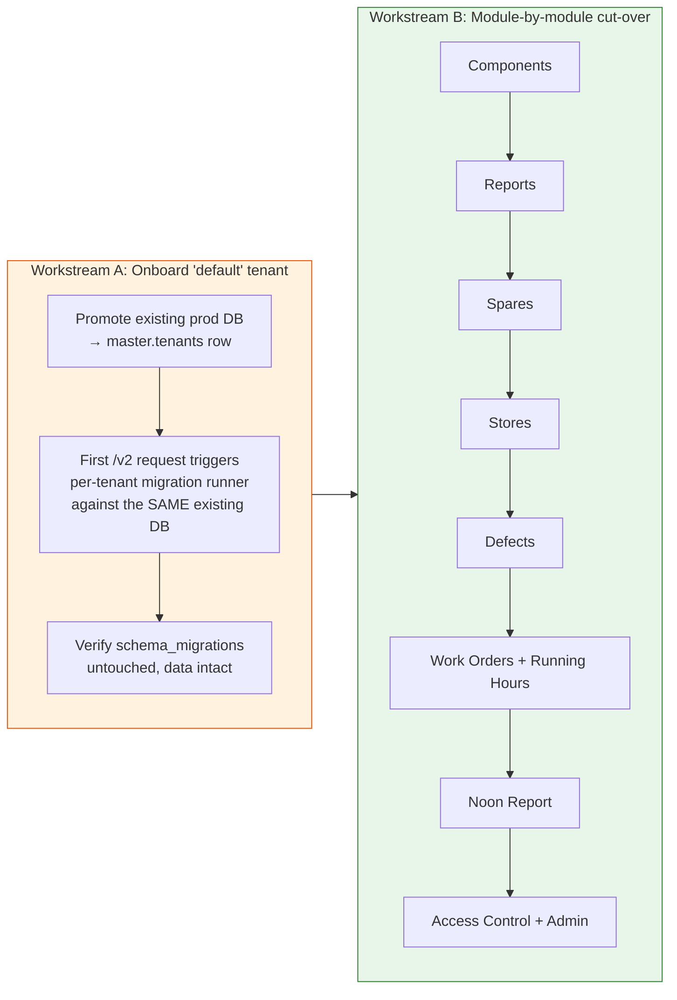

# Phase 4 — Per-Tenant Migrations + Module Cut-over

> **Goal:** Promote the existing prod database into the master registry as the "default" tenant, exercise the per-tenant migration path, then move PMS modules from the legacy `/technical/api` mount to the tenant-aware `/technical/api/v2` mount one at a time.
> **Risk:** 🔴 High (live data, multiplied blast radius)
> **Estimated effort:** 4–8 PRs, ~3 weeks
> **Prerequisites:** Phases 0–3 complete and shipped to staging
> **Unblocks:** Phase 5

---

## 1. The shape of this phase

Phases 0–3 built the machinery. Phase 4 **uses it on real data**. Two distinct workstreams run in sequence:



**Why module-by-module?** A bug in one module's `/v2` route only affects users of that one screen, and the legacy `/technical/api/<module>` mount is one git revert away. Big-bang cut-over puts every screen at risk on the same day — unnecessary in a production system this large.

---

## 2. Workstream A — Onboard the "default" tenant

### 2.1 The promotion script

`scripts/promote-to-tenant.ts`:

```typescript
import { Pool } from "pg";
import { drizzle } from "drizzle-orm/node-postgres";
import { tenants } from "@shared/master/schema";

const MASTER_URL = process.env.MASTER_DATABASE_URL!;
const TENANT_URL = process.env.PROMOTE_TENANT_URL ?? process.env.DATABASE_URL!;
const DOMAIN = process.env.PROMOTE_TENANT_DOMAIN!;
const COMPANY = process.env.PROMOTE_TENANT_COMPANY ?? "Default Tenant";

(async () => {
  const masterPool = new Pool({ connectionString: MASTER_URL });
  const masterDb = drizzle(masterPool);

  // Idempotent: skip if domain already registered
  const existing = await masterDb.select().from(tenants).where(/* eq(tenants.domain, DOMAIN) */);
  if (existing.length > 0) {
    console.log(`Tenant for domain ${DOMAIN} already exists: ${existing[0].tuid}`);
    await masterPool.end();
    return;
  }

  const [created] = await masterDb.insert(tenants).values({
    domain: DOMAIN,
    companyName: COMPANY,
    dbUrl: TENANT_URL,
    isActive: true,
  }).returning({ tuid: tenants.tuid });

  console.log(`✅ Registered tenant ${created.tuid} for domain ${DOMAIN}`);
  console.log(`   db_url = ${TENANT_URL}`);
  await masterPool.end();
})();
```

Run once per environment:

```bash
MASTER_DATABASE_URL="$STAGING_MASTER_URL" \
PROMOTE_TENANT_DOMAIN="staging.sail.example.com" \
PROMOTE_TENANT_COMPANY="Sail Maritime (Staging)" \
PROMOTE_TENANT_URL="$STAGING_DATABASE_URL" \
npx tsx scripts/promote-to-tenant.ts
```

**Idempotent.** Safe to re-run.

### 2.2 First `/v2` request — the migration moment of truth

When Workstream B sends the first request to `/technical/api/v2/components` for the default tenant, `TenantConnectionManager.getTenantDb(tuid)` runs:

1. Open new pool against `tenant.db_url` (which is the **same** `DATABASE_URL` we've been using).
2. Call `ensureMaintenanceHistoryImmutability(pool)` — already idempotent.
3. Call `runBackupAndMigrations(pool)` — checks `schema_migrations` table, sees every migration already applied, applies nothing.
4. Call `initializeDatabase(pool)` — idempotent reseeds.
5. Cache the pool.

**The danger:** if `runBackupAndMigrations` accidentally re-applies a migration, data corruption. Mitigations:

- Phase 0 already proved the pool-aware path works on a fresh DB.
- For the existing prod DB, run a **dry run** first: a script that connects as `getTenantDb` would but only **lists** what migrations would run (should be: none).

### 2.3 The dry-run script

`scripts/dry-run-tenant-migrations.ts`:

```typescript
// Connect to tenant DB, query schema_migrations, list which Drizzle and hand-written
// files have NOT been applied. Print, do not apply. Used as a Phase 4 gate.
```

Acceptance gate before flipping any module: dry run prints **zero pending migrations**.

### 2.4 Per-tenant audit log

Add a new admin endpoint `GET /technical/api/v2/admin/tenant-health`:

```json
{
  "tenants": [
    {
      "tuid": "abc-123",
      "companyName": "Default",
      "isActive": true,
      "lastConnected": "2026-04-24T09:00:00Z",
      "migrationsApplied": 142,
      "migrationsPending": 0,
      "poolSize": 3,
      "lastError": null
    }
  ]
}
```

Backed by a small in-memory map maintained by `TenantConnectionManager` plus a query against each tenant's `schema_migrations`. Polled by ops dashboard.

---

## 3. Workstream B — Module cut-over

### 3.1 Cut-over order (least → most critical)

| # | Module | Server file | Why this position |
|---|---|---|---|
| 1 | Components | `server/modules/components/` | Read-mostly; ideal smoke-test for the chain |
| 2 | Reports | `server/modules/reports/` | Read-only; safe to flip |
| 3 | Spares | `server/modules/spares/` | Inventory, isolated domain |
| 4 | Stores | `server/modules/stores/` | Inventory, isolated domain |
| 5 | Defects | `server/modules/defects/` | Wizard-heavy; broad UI surface |
| 6 | Work Orders + Running Hours | `server/modules/work-orders/`, `server/modules/running-hours/` | Heart of PMS — flip together as they share state |
| 7 | Noon Report | `server/modules/noon-report/` | Most direct-import files even after Phase 0; double-check |
| 8 | Access Control + Admin | `server/modules/access-control/` and admin routes | Last, because it controls who can see anything |

### 3.2 Per-module cut-over recipe

For each module, one PR that does:

**Server side:**
1. Confirm the module router has no module-specific paths in `server/modules/index.ts` that would break the new mount.
2. The module is **already** mounted under both `/technical/api` and `/technical/api/v2` (Phase 2 mounted the same `moduleRouter` twice). Nothing to change here.
3. Run side-by-side smoke: `curl /technical/api/<module>/X` and `curl -H 'x-tenant-id: …' -H 'Authorization: …' /technical/api/v2/<module>/X` — responses must match byte-for-byte (modulo timestamps).

**Frontend side:**
1. Find every `apiRequest(…, "/technical/api/<module>/…")` and `useQuery({ queryKey: ["/technical/api/<module>/…"] })` in the pages/components for this module.
2. Change the prefix to `/technical/api/v2/<module>/…`.
3. Update test fixtures.

**Verification:**
1. Manual smoke: every screen in the module renders and writes work.
2. Browser DevTools: confirm requests carry `x-tenant-id` + `Authorization`.
3. Server logs: confirm requests resolve to the right tuid.

### 3.3 Search-and-replace cheat sheet

For each module, run:

```bash
# Find all client-side references
grep -rn "/technical/api/<module>" client/src/ --include="*.ts" --include="*.tsx"

# Find all queryKey arrays
grep -rn "queryKey:.*\[.*\"/technical/api/<module>" client/src/
```

Replace with `/technical/api/v2/<module>`. Commit per-module to keep the diff reviewable.

### 3.4 Per-module acceptance gate

Before merging the cut-over PR for a module, **all of these must be true**:

- [ ] Side-by-side `curl` comparison shows identical responses.
- [ ] Manual smoke test passes (CRUD on at least one resource per module).
- [ ] All affected pages render without console errors.
- [ ] `tenant_health` endpoint shows no new pending migrations or errors.
- [ ] Rollback path verified: revert the PR locally, confirm screens work on legacy mount.

---

## 4. Schema gotcha — `vessels`, `users`, `fleets`

These three tables are in the per-tenant DB (Q3 default). After promoting the existing prod DB:

- All current `vessels`, `users`, `fleets` rows belong to the "default" tenant.
- A second tenant's database starts **empty** for these tables — they need their own seed data on onboarding.
- Cross-references are fine because each tenant DB is fully self-contained.

If Q3 is decided differently (vessels in master), this phase needs an extra **data-migration step** to move the rows. Defer until Q3 is answered.

---

## 5. Acceptance criteria for the phase

| # | Criterion | How to verify |
|---|---|---|
| 1 | `scripts/promote-to-tenant.ts` registers staging DB as `default` tenant successfully | Run script, query `master.tenants` |
| 2 | `dry-run-tenant-migrations.ts` reports 0 pending against staging | Run script |
| 3 | First `/v2/<module>` request to staging logs migration runner output: "0 applied, 142 skipped" | Server logs |
| 4 | All 8 modules cut over to `/v2` on staging | Manual smoke + automated test pass |
| 5 | `tenant_health` shows 0 errors over 48h on staging | Ops dashboard |
| 6 | Production rollout completed module-by-module behind a feature flag | Phase 5 prerequisite |
| 7 | Pool count at steady state ≤ 3 (one tenant) and stays bounded | Postgres `pg_stat_activity` |
| 8 | Side-by-side response diff between `/technical/api/<module>` and `/technical/api/v2/<module>` is empty for every module | Automated diff harness |

---

## 6. Risks & mitigations

| Risk | Severity | Mitigation |
|---|---|---|
| Per-tenant migration runner re-applies a migration on the existing prod DB | **Critical** | Dry-run gate (§2.3); manual review of `schema_migrations` table before first `/v2` request |
| One module's frontend cut-over misses a `queryKey` and stays on the legacy mount | Medium | Code review checklist; regex-driven cross-check at PR time |
| Onboarding a second tenant later fails because seed data scripts assume single-tenant | Medium | Document seed scripts as "per-tenant"; convert any global `INSERT` in `initDb.ts` to per-tenant |
| `tenant_health` endpoint accidentally reachable without auth → leaks tenant inventory | Medium | Mount under `/v2/admin/tenant-health` and require `Sail Admin` role |
| Cut-over PRs land out of order, breaking dependencies | Medium | Follow the order in §3.1 strictly; use feature branches and merge in order |
| Concurrent traffic during cut-over hits both mounts and creates conflicting writes | Low | Both mounts hit the **same DB** for the default tenant — no conflict |

---

## 7. Rollback plan

**Per-module rollback:**
1. Revert the frontend PR for that module → pages call legacy `/technical/api/<module>` again.
2. No DB rollback needed — same database serves both mounts.

**Full-phase rollback:**
1. Revert all module-cutover PRs.
2. Optionally `DELETE FROM master.tenants WHERE domain = 'staging.sail.example.com'` — pool cache forgets the tenant on restart.
3. Unset `MASTER_DATABASE_URL` to fully revert behaviour.

---

## 8. Production rollout checklist

After staging is fully cut over and stable for ≥1 week:

- [ ] Run `scripts/promote-to-tenant.ts` against prod with `PROMOTE_TENANT_URL=$PROD_DATABASE_URL`.
- [ ] Set `MASTER_DATABASE_URL` in prod env (this enables `/v2` mount).
- [ ] Set `JWT_SECRET` in prod env (must match parent SAIL-Audits prod value).
- [ ] Deploy server with `/v2` mount enabled.
- [ ] Deploy frontend with one module flipped at a time, observing for 24h between modules.
- [ ] After all 8 modules, run a 7-day soak on parallel mounts before Phase 5.

---

## 9. Definition of Done

- [ ] Promotion script written and run on staging.
- [ ] Dry-run script written and run; reports zero pending.
- [ ] `tenant_health` admin endpoint live and gated by `Sail Admin`.
- [ ] All 8 modules cut over on staging; soak test green for ≥48h.
- [ ] Production rollout per §8 completed.
- [ ] Side-by-side diff harness output: empty diffs across all modules.
- [ ] Acceptance criteria 1–8 green.
- [ ] All cut-over PRs merged.
