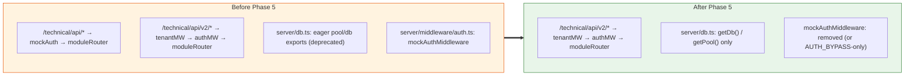

# Phase 5 — Decommission Legacy

> **Goal:** Remove the legacy `/technical/api` mount, `mockAuthMiddleware`, and the eager `pool`/`db` exports. Optionally migrate truly universal lookup tables to the master DB.
> **Risk:** 🟢 Low if Phase 4 was thorough; 🔴 High otherwise (legacy mount removal is irreversible without a revert)
> **Estimated effort:** 1 PR, ~3 days
> **Prerequisites:** Phase 4 fully complete, all modules served on `/v2`, ≥7 days of clean prod soak
> **Unblocks:** Optional follow-ups (encryption-at-rest for `tenants.db_url`, master-DB shared lookups)

---

## 1. Goal

Remove the back-compat scaffolding that let Phases 1–4 ship safely.



---

## 2. Files to modify

| Action | File | Change |
|---|---|---|
| ✏️ | `server/routes.ts` | Remove `app.use('/technical/api', mockAuthMiddleware)` and `app.use('/technical/api', moduleRouter)` |
| ✏️ | `server/middleware/auth.ts` | Delete `mockAuthMiddleware` and `initMockAuthRankId` (or gate behind `AUTH_BYPASS=true` for dev convenience) |
| ✏️ | `server/db.ts` | Remove the eager `pool`/`db` exports (lines 11–21); `getDb`/`getPool` remain |
| ✏️ | `server/postgresClient.ts` | The `cachedPostgres` global stays — it backs the **fallback** path of `getDb()` when no ALS context exists. Keep it; consider renaming to `legacyPostgres` for clarity |
| ✏️ | `replit.md` | Update the **Authentication** section to reflect new reality |
| ➕ | `docs/multi-tenant/POST-MIGRATION-OPS.md` (optional) | Ops runbook for adding new tenants |

---

## 3. Step-by-step

### Step 3.1 — Remove the legacy mount

Edit `server/routes.ts:24-31`:

```typescript
// REMOVED in Phase 5:
// await initMockAuthRankId();
// app.use('/technical/api', mockAuthMiddleware);
// app.use('/technical/api', moduleRouter);

// REMAINS (was added in Phase 2):
if (process.env.MASTER_DATABASE_URL) {
  const tenantRoutes = (await import('./modules/tenant/routes')).default;
  const { tenantMiddleware } = await import('./middleware/tenantMiddleware');
  const { authMiddleware } = await import('./middleware/authMiddleware');
  app.use('/technical/api/v2/tenant', tenantRoutes);
  app.use('/technical/api/v2', tenantMiddleware, authMiddleware, moduleRouter);
}
```

**Hard requirement:** `MASTER_DATABASE_URL` is now mandatory in all environments — single-tenant mode is gone. Document this in `replit.md`.

### Step 3.2 — Delete or gate `mockAuthMiddleware`

Two options. **Recommended:** keep behind `AUTH_BYPASS` for local dev, delete entirely otherwise.

`server/middleware/auth.ts`:

```typescript
// Phase 5: mockAuthMiddleware retained ONLY for AUTH_BYPASS=true local dev.
// In production, requests reach handlers via authMiddleware which sets req.user from JWT.

export const mockAuthMiddleware = (req, res, next) => {
  if (process.env.AUTH_BYPASS !== "true") {
    return res.status(500).json({ error: "mockAuthMiddleware called outside AUTH_BYPASS mode" });
  }
  // … existing mock setup …
};
```

This kills the security risk of the mock middleware accidentally being mounted in prod.

### Step 3.3 — Remove eager `db`/`pool` exports

Edit `server/db.ts`:

```typescript
// REMOVED in Phase 5: the eager singleton exports.
// All callers go through getDb() / getPool() and the ALS-aware path.

import { Pool } from 'pg';
import { drizzle } from 'drizzle-orm/node-postgres';
import * as schema from "@shared/schema";
import { resolvePostgres } from './postgresClient';
import { getCurrentTenantContext } from './utils/asyncLocalStorage';

export async function getDb() {
  const ctx = getCurrentTenantContext();
  if (ctx) return ctx.db;
  // Fallback path — only used by master DB migration runner and admin tools
  const postgres = await resolvePostgres();
  if (!postgres) throw new Error('PostgreSQL not available');
  return postgres.db;
}

export async function getPool() {
  const postgres = await resolvePostgres();
  if (!postgres) throw new Error('PostgreSQL not available');
  return postgres.pool;
}
```

Run `tsc --noEmit` and the Phase 0 `scripts/check-direct-db-imports.sh` — must be green.

### Step 3.4 — Update documentation

`replit.md` — replace the **Authentication** section:

```markdown
## Authentication

PMS authenticates against a parent SAIL-Audits app via JWT.

- **Multi-tenant mode** (production): `MASTER_DATABASE_URL`, `JWT_SECRET`, and the
  parent app must all be configured. Requests are routed to the right tenant DB
  via `TenantConnectionManager` + `AsyncLocalStorage`.
- **Dev bypass**: set `AUTH_BYPASS=true` and `VITE_AUTH_BYPASS=true` to skip
  JWT/tenant validation; `mockAuthMiddleware` populates `req.user`.

See `docs/multi-tenant/README.md` for the architecture overview.
```

### Step 3.5 — (Optional) Move universal lookups to master

If decided in [Decision Q3](./README.md#7-decision-log-open-questions): tables like `nationalities`, `ports`, `countries`, `ranks_master` move from per-tenant to master. This is a **separate follow-up PR** with its own migration plan:

1. Create master-side schema entries.
2. One-time data copy from any one tenant DB into master (they're identical universal data).
3. Update PMS code that reads these tables to query the master DB.
4. Drop the tables from each tenant DB.

**Don't bundle this with the legacy-removal PR** — it has independent risk.

---

## 4. Acceptance criteria

| # | Criterion | How to verify |
|---|---|---|
| 1 | `app.use('/technical/api', …)` no longer appears in `server/routes.ts` | grep |
| 2 | `curl /technical/api/work-orders` returns 404 | Manual |
| 3 | All app screens function exclusively via `/technical/api/v2/*` | E2E test pass |
| 4 | Phase 0 lint check still green | `bash scripts/check-direct-db-imports.sh` |
| 5 | `import { db } from "./db"` returns nothing in `server/` | grep |
| 6 | `import { pool } from "./db"` returns nothing in `server/` | grep |
| 7 | `mockAuthMiddleware` either deleted OR throws 500 unless `AUTH_BYPASS=true` | Code review |
| 8 | Prod soak after deploy: 24h with no 5xx attributable to auth/tenant | Monitoring |
| 9 | `replit.md` Authentication section updated | Diff review |

---

## 5. Risks & mitigations

| Risk | Mitigation |
|---|---|
| A page or background job still hits `/technical/api/<module>/X` and now 404s | Phase 4's per-module cut-over checklist; final grep before merging Phase 5 |
| Eager `db` removal breaks a hidden top-level usage in a file Phase 0 missed | Re-run Phase 0's lint check; also `tsc --noEmit` |
| Background services (e.g. alerts engine) run outside any request → no ALS context → throws | These services use the legacy `getDb()` fallback path which goes through `resolvePostgres()` and the singleton. **Deliberate design decision:** background jobs run in "system" context, not tenant context. Document explicitly. |
| Removing `mockAuthMiddleware` breaks dev workflow | Keep behind `AUTH_BYPASS=true`, document in README |

---

## 6. Background-job context — important nuance

PMS has at least the following background services (from `server/services/`):

- Alerts engine (overdue tasks, low stock)
- Maintenance schedule advancer
- Maybe report generators

After Phase 5, these still call `await getDb()`, but **outside any HTTP request** there is no ALS context. The fallback path returns the singleton legacy pool — which in multi-tenant mode is unset.

**Resolution options:**

1. **Per-tenant background loop** (recommended): the alerts engine queries `master.tenants`, then for each active tenant: `await tcm.runInTenantContext(tuid, () => runAlertsForOneTenant())`. This is a Phase 4.5 deliverable that needs to be done before Phase 5 — note in the cut-over checklist.

2. **System pool fallback**: if a job is genuinely cross-tenant (e.g. a system health check), keep using `resolvePostgres()` directly and document.

**Add to Phase 4 acceptance:** all background services explicitly handle multi-tenant context (option 1 or 2 chosen per service).

---

## 7. Rollback plan

If Phase 5 ships and a critical issue is found:

1. `git revert <Phase-5 PR>` — restores legacy mount and eager exports.
2. Redeploy.
3. Frontend continues to work because Phase 4 already moved it to `/v2` — but any 404s during the gap will be brief.

**Hard truth:** Phase 5 is the one phase with no graceful runtime rollback. Stage carefully.

---

## 8. Definition of Done

- [ ] Legacy `/technical/api` mount removed from `server/routes.ts`.
- [ ] `mockAuthMiddleware` deleted or `AUTH_BYPASS`-gated.
- [ ] Eager `pool`/`db` exports removed from `server/db.ts`.
- [ ] All background services explicitly multi-tenant aware (per §6).
- [ ] `replit.md` Authentication section updated.
- [ ] Phase 0 lint check green.
- [ ] Acceptance criteria 1–9 green.
- [ ] 24h prod soak clean.
- [ ] Optional: shared-lookups migration deferred to a follow-up issue if scoped out.
- [ ] PR merged.

---

## 9. After Phase 5 — what's left

The migration is **complete**. Possible follow-ups (each is its own scoped task, **not** part of this plan):

| Follow-up | Complexity | Notes |
|---|---|---|
| Encrypt `master.tenants.db_url` at rest | Low | Use `pgcrypto` or app-side AES; small migration |
| Move universal lookups to master DB | Medium | See §3.5 |
| Tenant self-service onboarding UI | Medium | Sail Admin–scoped admin panel |
| Per-tenant feature flags table in master | Low | Add `tenant_features` table |
| Cross-tenant analytics warehouse | High | Out of scope; separate ETL pipeline |
| Encryption at rest for tenant DBs themselves | Ops | Postgres TDE / cloud-provider feature |
