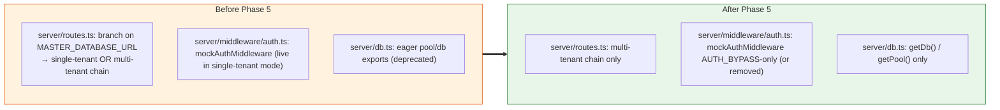

# Phase 5 — Decommission Single-Tenant Scaffolding

> **Goal:** Make multi-tenant mode mandatory. Remove the single-tenant boot branch in `server/routes.ts`, retire `mockAuthMiddleware` (or fence it behind `AUTH_BYPASS=true` for local dev), and drop the eager `pool`/`db` exports that pre-date the ALS path.
> **Risk:** 🟢 Low if Phase 4 was thorough; 🔴 High otherwise (this is the irreversible one)
> **Estimated effort:** 1 PR, ~3 days
> **Prerequisites:** Phase 4 fully complete, prod has been on multi-tenant mode for ≥7 days with no auth/tenant 5xx
> **Unblocks:** Optional follow-ups (encryption-at-rest for `tenants.db_url`, master-DB shared lookups)

---

## 1. Goal

Remove the back-compat scaffolding that let Phases 1–4 ship safely. After Phase 5, `MASTER_DATABASE_URL` is **mandatory** in every environment; there is no single-tenant fallback boot path.



---

## 2. Files to modify (in the future Phase 5 PR)

| Action | File | Change |
|---|---|---|
| ✏️ | `server/routes.ts` | Drop the `else` branch that mounts `mockAuthMiddleware`; the multi-tenant chain becomes unconditional |
| ✏️ | `server/middleware/auth.ts` | Delete `mockAuthMiddleware` and `initMockAuthRankId`, **or** fence them behind `AUTH_BYPASS=true` so they only run in local dev |
| ✏️ | `server/db.ts` | Remove the eager `pool`/`db` exports; `getDb`/`getPool` remain |
| ✏️ | `server/postgresClient.ts` | The `cachedPostgres` global stays — it backs the **fallback** path of `getDb()` when no ALS context exists (e.g. background jobs in system context). Consider renaming to `legacySystemPostgres` for clarity |
| ➕ | `docs/multi-tenant/POST-MIGRATION-OPS.md` (optional) | Ops runbook for adding new tenants |
| ✏️ | Project documentation | Update authentication section to reflect that multi-tenant mode is mandatory and reference this docs folder for the architecture |

> **Note:** The current documentation task (Task #128) does **not** modify `server/routes.ts`, `server/middleware/auth.ts`, or `replit.md`. The table above describes the scope of the future Phase 5 PR when it is actually executed.

---

## 3. Step-by-step (future Phase 5 PR)

### Step 3.1 — Drop the single-tenant boot branch

The `if (process.env.MASTER_DATABASE_URL) { … } else { … }` branch added in Phase 2 collapses to just the `if` body:

```typescript
// REMAINS (was added in Phase 2):
const tenantRoutes = (await import('./modules/tenant/routes')).default;
const { tenantMiddleware } = await import('./middleware/tenantMiddleware');
const { authMiddleware } = await import('./middleware/authMiddleware');
app.use('/technical/api/tenant', tenantRoutes);
app.use('/technical/api', tenantMiddleware, authMiddleware, moduleRouter);

// REMOVED in Phase 5:
//   else { mockAuthMiddleware path }
```

**Hard requirement:** `MASTER_DATABASE_URL` is now mandatory in all environments. If it is missing at boot, fail fast with a clear error rather than silently falling back.

### Step 3.2 — Delete or gate `mockAuthMiddleware`

Two options. **Recommended:** keep behind `AUTH_BYPASS=true` for local dev, fail loud otherwise.

Sketch (in `server/middleware/auth.ts` when Phase 5 is executed):

```typescript
// Phase 5: mockAuthMiddleware retained ONLY for AUTH_BYPASS=true local dev.
// In every other context, requests reach handlers via authMiddleware which sets
// req.user from JWT.

export const mockAuthMiddleware = (req, res, next) => {
  if (process.env.AUTH_BYPASS !== "true") {
    return res.status(500).json({ error: "mockAuthMiddleware called outside AUTH_BYPASS mode" });
  }
  // … existing mock setup …
};
```

This kills the security risk of the mock middleware accidentally being mounted in prod. Note that with the boot branch removed (§3.1), the only way `mockAuthMiddleware` runs is if `AUTH_BYPASS=true` and a developer wires it explicitly in a dev-only path — so the guard above is belt-and-braces.

### Step 3.3 — Remove eager `db`/`pool` exports

`server/db.ts` becomes ALS-aware only:

```typescript
// REMOVED in Phase 5: the eager singleton exports.
// All callers go through getDb() / getPool() and the ALS-aware path.

import { Pool } from 'pg';
import { drizzle } from 'drizzle-orm/node-postgres';
import * as schema from "@shared/schema";
import { resolvePostgres } from './postgresClient';
import { getCurrentTenantContext } from './utils/asyncLocalStorage';

export async function getDb() {
  const ctx = getCurrentTenantContext();
  if (ctx) return ctx.db;
  // Fallback path — only used by background services running in system context
  const postgres = await resolvePostgres();
  if (!postgres) throw new Error('PostgreSQL not available');
  return postgres.db;
}

export async function getPool() {
  const postgres = await resolvePostgres();
  if (!postgres) throw new Error('PostgreSQL not available');
  return postgres.pool;
}
```

Run `tsc --noEmit` and the Phase 0 `scripts/check-direct-db-imports.sh` — must be green.

### Step 3.4 — Update project documentation

Update the project's authentication/architecture documentation to reflect the new reality: PMS authenticates against a parent SAIL-Audits app via JWT, multi-tenant mode is mandatory, and `mockAuthMiddleware` only runs in `AUTH_BYPASS` dev mode. Reference `docs/multi-tenant/README.md` for the architecture overview.

### Step 3.5 — (Optional) Move universal lookups to master

If decided in [Decision Q3](./README.md#7-decision-log-open-questions): tables like `nationalities`, `ports`, `countries`, `ranks_master` move from per-tenant to master. This is a **separate follow-up PR** with its own migration plan:

1. Create master-side schema entries.
2. One-time data copy from any one tenant DB into master (they're identical universal data).
3. Update PMS code that reads these tables to query the master DB.
4. Drop the tables from each tenant DB.

**Don't bundle this with the decommission PR** — it has independent risk.

---

## 4. Acceptance criteria

| # | Criterion | How to verify |
|---|---|---|
| 1 | `server/routes.ts` no longer contains the `else` branch that mounts `mockAuthMiddleware` | grep |
| 2 | Booting without `MASTER_DATABASE_URL` fails fast with a clear error | Manual: unset env var, restart, observe |
| 3 | All app screens function via `/technical/api/*` with the multi-tenant chain | E2E test pass |
| 4 | Phase 0 lint check still green | `bash scripts/check-direct-db-imports.sh` |
| 5 | `import { db } from "./db"` returns nothing in `server/` | grep |
| 6 | `import { pool } from "./db"` returns nothing in `server/` | grep |
| 7 | `mockAuthMiddleware` either deleted OR throws 500 unless `AUTH_BYPASS=true` | Code review |
| 8 | Prod soak after deploy: 24h with no 5xx attributable to auth/tenant | Monitoring |
| 9 | Project authentication documentation updated | Diff review |

---

## 5. Risks & mitigations

| Risk | Mitigation |
|---|---|
| A page or background job still relies on the single-tenant boot path → 500s after the flip | Phase 4 must close all gaps before this PR; final grep for `mockAuthMiddleware` references before merging |
| Eager `db` removal breaks a hidden top-level usage in a file Phase 0 missed | Re-run Phase 0's lint check; also `tsc --noEmit` |
| Background services (e.g. alerts engine) run outside any request → no ALS context → throws | See §6 — this must be addressed in Phase 4.5 before Phase 5 |
| Removing `mockAuthMiddleware` breaks dev workflow | Keep behind `AUTH_BYPASS=true`, document in README |
| Fail-fast on missing `MASTER_DATABASE_URL` blocks a hot restart in an environment that lost the var | Ops checklist: confirm env vars before every restart; the same is already true for `DATABASE_URL` |

---

## 6. Background-job context — important nuance

PMS has at least the following background services (from `server/services/`):

- Alerts engine (overdue tasks, low stock)
- Maintenance schedule advancer
- Maybe report generators

After Phase 5, these still call `await getDb()`, but **outside any HTTP request** there is no ALS context. The fallback path returns the singleton legacy pool — which in multi-tenant mode is unset.

**Resolution options:**

1. **Per-tenant background loop** (recommended): the alerts engine queries `master.tenants`, then for each active tenant: `await tcm.runInTenantContext(tuid, () => runAlertsForOneTenant())`. This is a Phase 4.5 deliverable that needs to be done before Phase 5 — note in the cut-over checklist.

2. **System pool fallback**: if a job is genuinely cross-tenant (e.g. a system health check), keep using `resolvePostgres()` directly and document.

**Add to Phase 4 acceptance:** all background services explicitly handle multi-tenant context (option 1 or 2 chosen per service).

---

## 7. Rollback plan

If Phase 5 ships and a critical issue is found:

1. `git revert <Phase-5 PR>` — restores the boot branch and eager exports.
2. Redeploy.
3. The frontend continues to work because the API surface is unchanged; the rollback restores the multi-tenant chain (which has been live since Phase 4) — Phase 5 only removed the unused single-tenant fallback and the eager DB exports.

**Hard truth:** Phase 5's irreversibility is conceptual, not operational — once removed, the single-tenant fallback path is gone from the binary, and any environment that loses `MASTER_DATABASE_URL` after this point fails to boot. Stage carefully.

---

## 8. Definition of Done

- [ ] Single-tenant boot branch removed from `server/routes.ts`.
- [ ] `mockAuthMiddleware` deleted or `AUTH_BYPASS`-gated.
- [ ] Eager `pool`/`db` exports removed from `server/db.ts`.
- [ ] All background services explicitly multi-tenant aware (per §6).
- [ ] Project authentication documentation updated to reference `docs/multi-tenant/README.md`.
- [ ] Phase 0 lint check green.
- [ ] Acceptance criteria 1–9 green.
- [ ] 24h prod soak clean.
- [ ] Optional: shared-lookups migration deferred to a follow-up issue if scoped out.
- [ ] PR merged.

---

## 9. After Phase 5 — what's left

The migration is **complete**. Possible follow-ups (each is its own scoped task, **not** part of this plan):

| Follow-up | Complexity | Notes |
|---|---|---|
| Encrypt `master.tenants.db_url` at rest | Low | Use `pgcrypto` or app-side AES; small migration |
| Move universal lookups to master DB | Medium | See §3.5 |
| Tenant self-service onboarding UI | Medium | Sail Admin–scoped admin panel |
| Per-tenant feature flags table in master | Low | Add `tenant_features` table |
| Cross-tenant analytics warehouse | High | Out of scope; separate ETL pipeline |
| Encryption at rest for tenant DBs themselves | Ops | Postgres TDE / cloud-provider feature |
