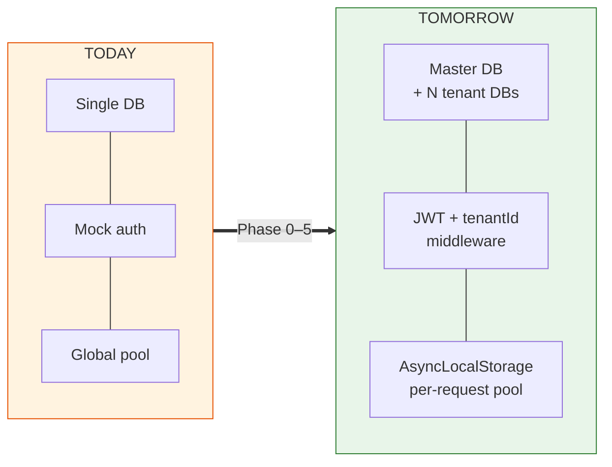
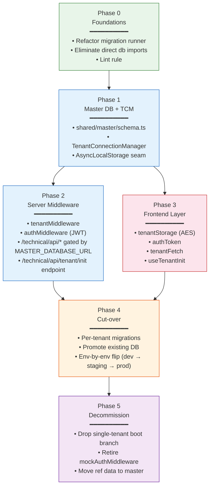
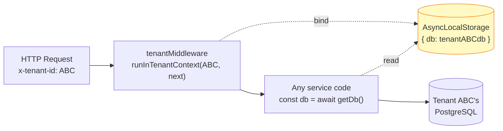
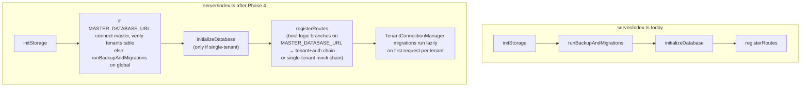
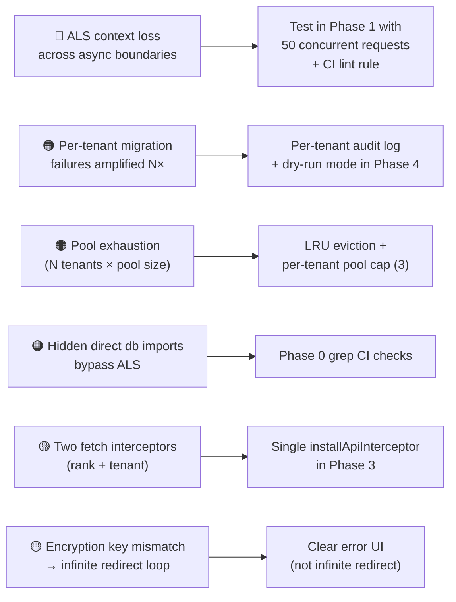

# PMS Multi-Tenant Migration — Master Plan

> **One file to rule them all.** This is the executive summary that ties together every phase of the multi-tenant migration. Each phase has its own dedicated file (linked below) with full implementation detail.

---

## 📂 Document Set

| # | Phase | File | Risk | Behaviour change |
|---|---|---|---|---|
| **00** | **Overview (this file)** | `README.md` | — | — |
| 0 | Foundations — seam refactor | [`Phase-0-Foundations.md`](./Phase-0-Foundations.md) | 🟢 Low | None (pure refactor) |
| 1 | Master DB + Connection Manager | [`Phase-1-Master-DB-Connection-Manager.md`](./Phase-1-Master-DB-Connection-Manager.md) | 🟡 Medium | None (gated by env flag) |
| 2 | Server middleware chain | [`Phase-2-Server-Middleware.md`](./Phase-2-Server-Middleware.md) | 🟡 Medium | Adds tenant + JWT chain to `/technical/api/*`, gated by `MASTER_DATABASE_URL` |
| 3 | Frontend tenant layer | [`Phase-3-Frontend-Tenant-Layer.md`](./Phase-3-Frontend-Tenant-Layer.md) | 🟡 Medium | New code path; single-tenant still works |
| 4 | Per-tenant migrations + environment cut-over | [`Phase-4-Migrations-Cutover.md`](./Phase-4-Migrations-Cutover.md) | 🔴 High | Live cut-over: dev → staging → prod |
| 5 | Decommission single-tenant scaffolding | [`Phase-5-Decommission.md`](./Phase-5-Decommission.md) | 🟢 Low | Multi-tenant becomes mandatory; mock auth retired |

> Companion doc: [`../V2-Multi-Tenant-Approach.md`](../V2-Multi-Tenant-Approach.md) — long-form architectural blueprint with diagrams.

---

## 1. Where PMS is Today (Anchored to Real Files)

| Concern | Today | Reference |
|---|---|---|
| Auth | `mockAuthMiddleware` injects hardcoded `Sail Admin` on every request | `server/middleware/auth.ts` |
| DB pool | Single global `pg.Pool` from `process.env.DATABASE_URL`, lazy-cached | `server/postgresClient.ts`, `server/db.ts` |
| Storage | `IStorage` implemented once in `postgresStorage.ts` (~100 methods, all start with `await getDb()`) | `server/storage.ts`, `server/postgresStorage.ts` |
| Routes | All mounted under `/technical/api` via `moduleRouter` (single API surface — no `/v2` prefix) | `server/routes.ts`, `server/modules/index.ts` |
| Frontend fetch | TanStack Query default fetcher; `installRankFetchInterceptor` injects only `x-rank` | `client/src/lib/queryClient.ts`, `client/src/lib/activeRank.ts` |
| Schema | 96 tables in `shared/schema.ts`; **no `tenant_id` anywhere**; soft tenancy via `vessel_id` | `shared/schema.ts` |
| Migrations | `runDrizzleMigrations` + `runHandWrittenMigrations` at startup; **never `db:push`** on existing DB (post-085 rule) | `server/migrations.ts`, `replit.md` |
| Boot order | `initStorage` → `runBackupAndMigrations` → `initializeDatabase` → `registerRoutes` | `server/index.ts:46-55` |

**Direct DB-coupling debt to clean up in Phase 0** (files that import `db` directly instead of using `getDb()`):

```
server/modules/bulk-upload/controllers/bulkController.ts
server/modules/components/services/componentService.ts
server/modules/noon-report/repositories/bunkerRepository.ts
server/modules/noon-report/repositories/noonReportRepository.ts
server/modules/noon-report/services/alertEngine.ts
server/modules/noon-report/services/noonReportService.ts
server/modules/noon-report/services/calculationEngine.ts
server/modules/noon-report/utils/existingDataAdapter.ts
server/replit_integrations/chat/storage.ts
```

These 9 files are the "long tail" that must be converted from `import { db } from "../db"` → `const db = await getDb()` before Phase 1 ships.

---

## 2. Where We're Going



---

## 3. Phase Dependency Graph



**Key parallelism:** After Phase 1 lands, Phases 2 (server) and 3 (frontend) can be built in parallel by different engineers — they only converge at Phase 4.

---

## 4. The Single Big Idea

Every multi-tenant change in this plan exists to support one invariant:

> **Inside any request handler, `await getDb()` returns the database for *this request's tenant* — automatically, with no parameter passing.**

That invariant is what makes the migration tractable. Once Phase 1 is in place, the existing `postgresStorage.ts` (which already calls `await getDb()` everywhere) becomes tenant-aware **without touching a single storage method**. The 96-table schema, all module repositories, all services — none of them need to know multi-tenancy exists.



---

## 5. End-to-End Execution Plan for PMS

The phases below are **PMS-specific** — file paths, env vars, and gotchas reference the actual codebase.

### Phase 0 — Foundations (1 PR, ~1 week)
**What changes:** `server/migrations.ts`, `server/initDb.ts`, `server/db.ts`, the 9 direct-import files listed above. **What doesn't change:** behaviour. The single-tenant deploy keeps working identically.

- Refactor `runDrizzleMigrations(pool?)` and `runHandWrittenMigrations(pool?)` to accept an optional `Pool` argument; default to the current global.
- Refactor `initializeDatabase()` and `ensureMaintenanceHistoryImmutability()` similarly.
- Convert the 9 files that `import { db }` directly to use `await getDb()`.
- Add a CI grep check: `grep -rn 'import { db }' server/ --include="*.ts" | grep -v 'getDb'` must return zero matches.
- Add a CI grep check: `grep -rn 'import { pool }' server/ --include="*.ts"` must return zero matches.

**Acceptance:** All existing tests pass; `npm run dev` boots and serves identically; lint check is green.

→ Full detail: [`Phase-0-Foundations.md`](./Phase-0-Foundations.md)

### Phase 1 — Master DB + Connection Manager (1–2 PRs, ~1.5 weeks)
**What changes:** New master schema, new `TenantConnectionManager`, `getDb()` becomes ALS-aware. **What doesn't change:** still no tenant requests being served.

- Add `MASTER_DATABASE_URL` env var. Master DB stays empty until Phase 2.
- Create `shared/master/schema.ts` with the `tenants` table only.
- Build `server/utils/tenantConnectionManager.ts`: pool cache (Map<tuid, Pool>), domain TTL cache (5 min), `runInTenantContext`, `getTenantDb`, `validateTuid`.
- Modify `server/db.ts` `getDb()`: if inside ALS context, return that DB; else return legacy global.
- Add concurrency test: fire 50 parallel requests under different tenant contexts, assert each query hits the right DB.

**Acceptance:** Concurrency test green; without `MASTER_DATABASE_URL`, app behaves exactly as today.

→ Full detail: [`Phase-1-Master-DB-Connection-Manager.md`](./Phase-1-Master-DB-Connection-Manager.md)

### Phase 2 — Server Middleware (1 PR, ~1 week)
**What changes:** The existing `/technical/api/*` mount is wrapped in `tenantMiddleware → authMiddleware` when `MASTER_DATABASE_URL` is set. There is no parallel route prefix — PMS keeps a single API surface and the boot logic picks the chain.

- New files: `server/middleware/tenantMiddleware.ts`, `server/middleware/authMiddleware.ts`, `server/middleware/exemptPaths.ts`.
- New env vars: `JWT_SECRET`, `AUTH_BYPASS`.
- New endpoint: `POST /technical/api/tenant/init` mounted at `/technical/api/tenant` **before** the catch-all chain (exempt from tenant + auth middleware).
- Boot logic in the route registration file branches on `MASTER_DATABASE_URL`: when set, mounts the tenant + auth chain; when unset, falls back to today's `mockAuthMiddleware` chain.
- The two chains are mutually exclusive — `mockAuthMiddleware` is **not** mounted when multi-tenant mode is active.

**Acceptance:** Without `MASTER_DATABASE_URL` the server behaves identically to today; with it set, every `/technical/api/*` request requires `x-tenant-id` + `Authorization`, and `/technical/api/tenant/init` is reachable without either.

→ Full detail: [`Phase-2-Server-Middleware.md`](./Phase-2-Server-Middleware.md)

### Phase 3 — Frontend Tenant Layer (1–2 PRs, ~1.5 weeks)
**What changes:** New client-side modules; existing pages keep working until Phase 4 cut-over.

- New files: `client/src/lib/tenantStorage.ts`, `client/src/lib/authToken.ts`, `client/src/lib/tenantFetch.ts`, `client/src/hooks/useTenantInit.ts`.
- Reuse `client/src/utils/secureStorage.ts` for AES (already in the codebase).
- Consolidate the existing `installRankFetchInterceptor` into a single `installApiInterceptor` that injects `x-rank` + `x-tenant-id` + `Authorization` together.
- Wire into `client/src/App.tsx`: auth guard → `useTenantInit` → render the existing app.
- New env vars: `VITE_PARENT_LOGIN_URL`, `VITE_AUTH_BYPASS`.

**Acceptance:** With `VITE_AUTH_BYPASS=true`, app loads identically to today. With bypass off, missing token redirects to `VITE_PARENT_LOGIN_URL`.

→ Full detail: [`Phase-3-Frontend-Tenant-Layer.md`](./Phase-3-Frontend-Tenant-Layer.md)

### Phase 4 — Per-Tenant Migrations + Environment Cut-over (4–6 PRs / ops actions, ~3 weeks)
**What changes:** This is the live one. The existing prod DB gets registered as the "default" tenant, and `MASTER_DATABASE_URL` is flipped on environment-by-environment. Because PMS has a single API surface, the unit of risk is the environment, not the module — there is no per-route toggle.

- Promotion script `scripts/promote-to-tenant.ts`: writes one row to `master.tenants` pointing `db_url = current DATABASE_URL`.
- Dry-run script `scripts/dry-run-tenant-migrations.ts`: must report **zero pending migrations** before flipping any environment.
- `TenantConnectionManager.getTenantDb(tuid)` runs the full migration suite on first connection (re-uses Phase 0 pool-aware runner) — a no-op against a promoted existing DB.
- Add `tenant_health` admin endpoint at `/technical/api/admin/tenant-health` (Sail Admin gated): per-tenant migration status.
- **Environment promotion order:** dev → staging (≥48 h soak) → prod (≥7 d soak).
- **Post-flip smoke order in each environment** (least → most critical, to surface regressions safely):
  1. Components (read-mostly)
  2. Reports (read-only)
  3. Spares
  4. Stores
  5. Defects
  6. Work Orders + Running Hours (heart of PMS — exercise together)
  7. Noon Report (has the most direct-import files even after Phase 0; double-check)
  8. Access Control + Admin
- Dev parity harness: boot one server with `MASTER_DATABASE_URL` set and one without, both pointing at the same DB; diff GET responses across all 8 modules → must be empty.

**Acceptance:** Parity diff empty in dev; per-tenant migration audit log shows green for the default tenant in every environment; staging and prod soak windows pass without 5xx attributable to tenant/auth.

→ Full detail: [`Phase-4-Migrations-Cutover.md`](./Phase-4-Migrations-Cutover.md)

### Phase 5 — Decommission Single-Tenant Scaffolding (1 PR, ~3 days)
**What changes:** Make multi-tenant mode mandatory. Drop the single-tenant boot branch in the route registration file, retire `mockAuthMiddleware` (or fence behind `AUTH_BYPASS=true` for local dev), and remove the eager `pool`/`db` exports. Optionally migrate read-only reference tables to master.

- Drop the `else` branch (the one that mounts `mockAuthMiddleware`) from the boot logic in the route registration file. The multi-tenant chain becomes unconditional.
- Gate `mockAuthMiddleware` behind `AUTH_BYPASS=true` for dev only, or delete entirely.
- Remove the eager `pool`/`db` exports from `server/db.ts`; only `getDb()` / `getPool()` remain.
- Optional: move `nationalities`, `ports`, `countries`, `ranks_master` to master DB (see Phase 5 doc for the trade-offs).

**Acceptance:** Booting without `MASTER_DATABASE_URL` fails fast with a clear error; QA suite green; `tenant_health` shows all tenants migrated.

→ Full detail: [`Phase-5-Decommission.md`](./Phase-5-Decommission.md)

---

## 6. Cross-Phase Concerns

### 6.1 Migration policy (non-negotiable)
The PMS project's `replit.md` explicitly forbids `db:push` on existing databases — the post-085 incident corrupted migration tracking. **All schema changes** in every phase, including the new master schema and per-tenant migrations, follow the documented workflow:

```
1. Edit shared/{schema,master/schema}.ts
2. npm run db:generate            # creates migrations/0XXX_*.sql
3. Review the generated SQL
4. Commit
5. Server applies on next start (per tenant in multi-tenant mode)
```

### 6.2 Environment variable contract

| Variable | Phase introduced | Required when |
|---|---|---|
| `DATABASE_URL` | (existing) | Always |
| `MASTER_DATABASE_URL` | 1 | Multi-tenant mode |
| `JWT_SECRET` | 2 | Multi-tenant mode |
| `AUTH_BYPASS` | 2 | Dev only |
| `VITE_PARENT_LOGIN_URL` | 3 | Multi-tenant mode |
| `VITE_AUTH_BYPASS` | 3 | Dev only |
| `VITE_CLIENT_ENCRYPTION_KEY` | 3 | Multi-tenant mode (alias of existing `VITE_STORAGE_SECRET`) |

**Mode detection:** `MASTER_DATABASE_URL` presence at boot is the single switch that activates multi-tenant mode. Without it, every phase's code lies dormant and PMS runs as today.

### 6.3 Boot sequence evolution



### 6.4 Schema split summary

| Table family | Stays per-tenant? | Notes |
|---|---|---|
| `users`, `vessels`, `fleets` | ✅ Per-tenant | Each company owns its fleet |
| `components`, `jobs`, `work_orders`, `defects` | ✅ Per-tenant | Core transactional data |
| `spares`, `stores`, `spare_location_stock` | ✅ Per-tenant | |
| `running_hours_audit`, `spares_history`, `stores_ledger` | ✅ Per-tenant | |
| `master_list_types` (defect categories, criticality, etc.) | ✅ Per-tenant | Tenant-customizable |
| `nationalities`, `ports`, `countries`, `ranks_master` | 🔵 Master DB (Phase 5, optional) | Universal lookups |
| `tenants` | 🔵 Master DB | New table |

### 6.5 Shared risks (full register in [`../V2-Multi-Tenant-Approach.md`](../V2-Multi-Tenant-Approach.md))



---

## 7. Decision Log (Open Questions)

These need answers **before Phase 1 starts**. Each decision propagates downstream.

| # | Question | Default if not decided | Affects |
|---|---|---|---|
| Q1 | Same parent SAIL-Audits app as Crewing (shared JWT secret + AES key)? | Assume yes | Phase 2, Phase 3 |
| Q2 | Existing prod DB → "default" tenant or green-field? | Promote existing | Phase 4 |
| Q3 | Vessel/fleet master records: per-tenant or master? | Per-tenant | Phase 1 schema, Phase 5 |
| Q4 | Keep `x-rank` impersonation or carry rank in JWT? | Keep `x-rank` for QA | Phase 3 (interceptor design) |
| Q5 | Cut-over timeline — gradual or big-bang? | Gradual (recommended) | Phase 4 |
| Q6 | Per-tenant infra — N DBs on one server or N servers? | N DBs on one server | Ops, not code |

---

## 8. Success Metrics

| Metric | Target |
|---|---|
| Cross-tenant data leak in pen test | **0** |
| `getDb()` calls outside ALS context (after Phase 4) | **0** |
| Per-tenant migration success rate | **100%** for "default" tenant; alert on any others |
| Median request latency overhead from middleware chain | **< 5 ms** |
| Pool count at steady state with 10 active tenants | **≤ 30 connections** (3 per tenant cap) |
| Files still importing `db` directly (after Phase 0) | **0** |
| Modules verified on the multi-tenant chain after the env flip (Phase 4) | **All 8** |
| Single-tenant boot branch references in the route registration file (after Phase 5) | **0** |

---

## 9. Glossary

| Term | Meaning |
|---|---|
| **tuid** | Tenant UUID — primary key of `master.tenants` |
| **Master DB** | Database holding the `tenants` registry (and optionally shared lookups) |
| **Tenant DB** | Per-customer PostgreSQL database holding all 96 PMS tables for that tenant |
| **TCM** | `TenantConnectionManager` — singleton class that owns the per-tenant pool cache and ALS plumbing |
| **ALS** | `AsyncLocalStorage` — Node.js built-in for binding values to a specific async execution context |
| **Exempt paths** | Routes that skip `tenantMiddleware`/`authMiddleware` (health checks, `/tenant/init`) |
| **Domain** | Tenant identifier from the parent app's `localStorage["domain"]` (e.g. `acme-shipping.example.com`) |
| **Multi-tenant chain** | The `tenantMiddleware → authMiddleware → moduleRouter` stack mounted at `/technical/api/*` when `MASTER_DATABASE_URL` is set. PMS has a single API surface — there is no `/v2` prefix. |
| **Promotion script** | `scripts/promote-to-tenant.ts` — registers the existing prod DB as the "default" tenant |
| **post-085 rule** | The strict no-`db:push` rule from `replit.md`, established after migration 085 corrupted schema tracking |
